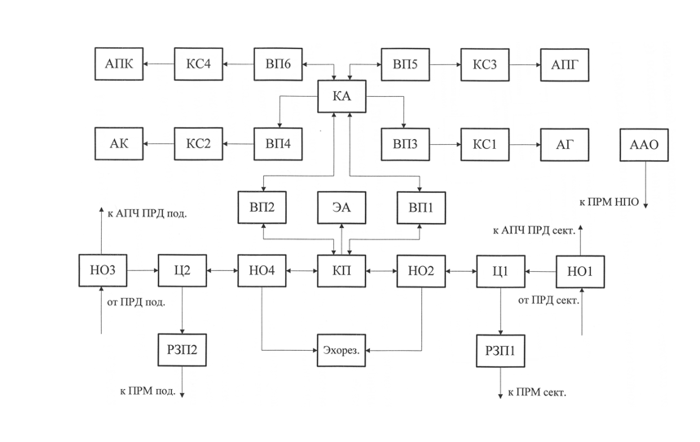
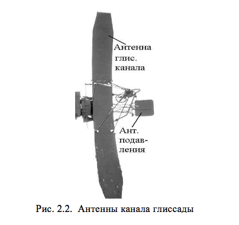
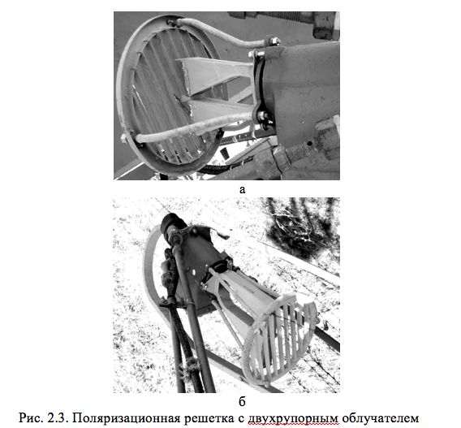
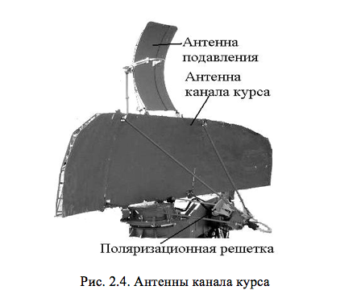
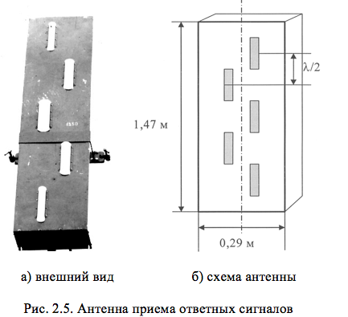
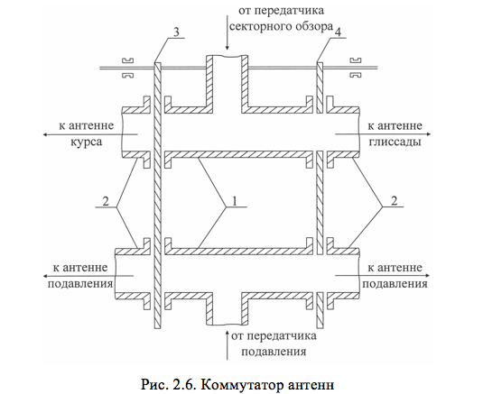
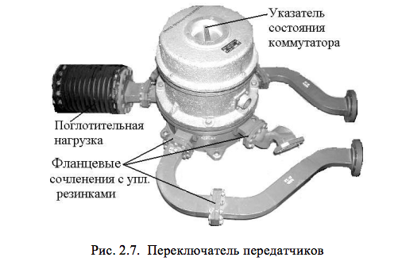
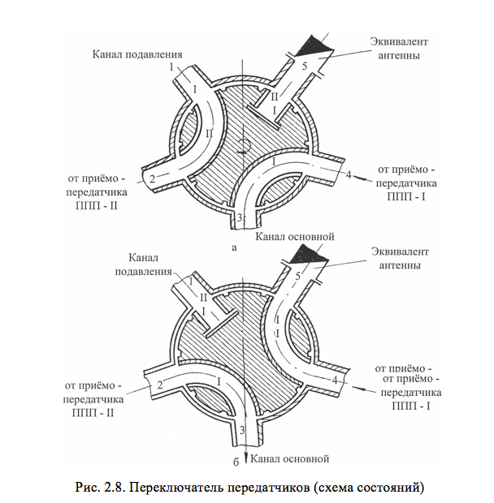
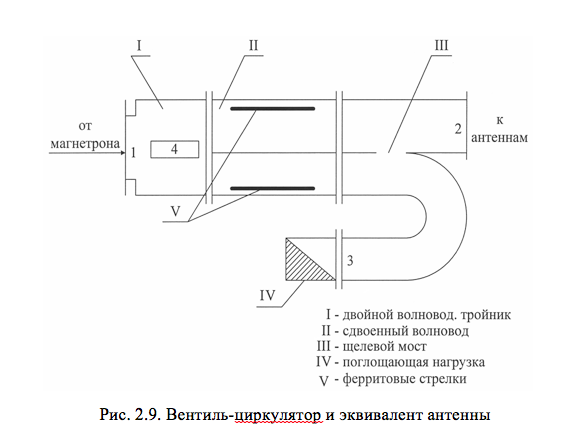
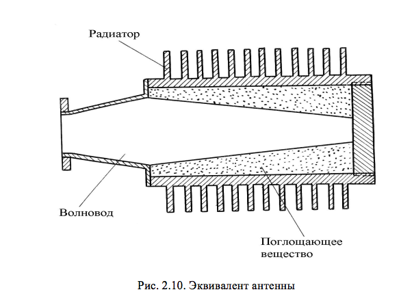

# АНТЕННЫ И ЭЛЕМЕНТЫ СВЧ АВУ, ИХ КОНСТРУКЦИЯ

<b>Антенны канала глиссады</b>

Антенны канала глиссады  включают основную антенну глиссады и антенну подавления (рис.2.2).

Антенна глиссады относится к зеркальному типу и состоит из облучателя и металлического отражателя (зеркала). В качестве зеркала используется несимметричная вырезка параболоида вращения с фокусным расстоянием 1,32 м. Вертикальный размер зеркала составляет 5 м, горизонтальный – 0,5 м. Облучатель антенны глиссады – двухрупорный. Он состоит из двух одинаковых рупоров, питаемых из общего прямоугольного волновода. Перед раскрывом облучателя установлена поляризационная решетка, предназначенная для преобразования электромагнитного поля с линейной поляризацией  в поле с круговой или эллиптической поляризацией для подавления пассивных помех, создаваемых метеорологическими образованиями в атмосфере.

Рис. 2.1. Структурная схема АВС

Поляризационная решетка позволяет улучшить отношение мощности сигнала от цели к сигналу от метеообразований на 8…25 дБ (рис.2.3). Величина 8 дБ соответствует таким осадкам, как, например, мокрый снег. Улучшение на 25 дБ возможно, когда дождевые капли по форме близки к сферическим, а отражениями от земной поверхности можно пренебречь. В основу подавления положен принцип, заключающийся в следующем: излучаемое антенной электромагнитное поле круговой или эллиптической поляризации после отражения не будет пропущено поляризационной решеткой в волноводный тракт, если направление вращения векторов электрических полей излучаемой и отраженной волн  будет противоположным. Это имеет место при отражении от метеообразований, представляющих собой мелкие частицы сферической формы. При  отражении от самолета (в силу сложности его конфигурации) данный эффект выражен слабо, однако полезный сигнал ослабляется на 6…8 дБ. Поэтому в отсутствии метеообразований следует пользоваться линейной поляризацией (угол поворота решетки 0&deg;). Конструктивно поляризационная решетка представляет собой ряд параллельных пластин, заключенных в обойму, которая соединяется с электроприводом вращения решетки, входящим в блок облучателя. Управление вращением решетки дистанционное с панели оперативного управления приводом антенн (ПОУ-П). Поворот осуществляется от 0&deg; до 60&deg;. При этом поляризация меняется от линейной через эллиптическую к круговой (в положении 45&deg;) и вновь в эллиптическую. В общем случае оператор, наблюдая за радиолокационной обстановкой на ИКГ, устанавливает такой угол поворота решетки, при котором интенсивность помеховых засветок будет минимальной. 

Антенна подавления глиссады предназначена для направленного излучения в пространство мощных одиночных СВЧ импульсов подавления (&tau;и = 0,9 мкс). Антенна представляет собой систему, состоящую из облучателя и зеркала. В качестве зеркала используется несимметричная вырезка параболоида вращения с фокусным расстоянием 0,35 м. Вертикальный размер зеркала составляет 0,4 м, горизонтальный – 0,5 м. По центру зеркала установлена горизонтально металлическая пластина шириной 70 мм, предназначенная для расширения диаграммы направленности антенны по углу места. В качестве облучателя используется пирамидальный рупор.

<b>Антенны канала курса</b>

Антенны канала курса включают основную антенну курса и антенну подавления (рис.2.4). В качестве зеркала основной антенны курса используется несимметричная вырезка параболоида вращения с фокусным расстоянием 1,05 м. Вертикальный размер зеркала составляет 1,1 м, горизонтальный – 3,5 м. Двухрупорный облучатель антенны курса аналогичен облучателю антенны глиссады, с той лишь разницей, что деление мощности между рупорами осуществляется в отношении 5:1, при этом большая часть мощности подводится к верхнему рупору. 

Антенна подавления курса аналогична антенне подавления глиссады. Вертикальный размер зеркала составляет 1,1 м, горизонтальный – 0,4 м. Фокусное расстояние – 0,35 м. Облучатель – рупорный.

<b>Антенна приема ответных сигналов</b>

Антенна приема ответных сигналов предназначена для приема ответных сигналов самолетного ответчика. Она представляет собой щелевую антенную решетку (ЩАР), выполненную из отрезка прямоугольного волновода (рис.2.5). Щели располагаются относительно друг друга на расстоянии, равном половине длины волны в волноводе. для того чтобы все щели возбуждались синфазно, они прорезаны симметрично  слева и справа относительно средней линии широкой стенки волновода. Торцы волновода наглухо закрытыметаллическими стенками. Антенна возбуждается в центре с помощью штыря, выведенного в середину задней широкой стенки волновода.

<b>Коммутатор антенн</b>

Коммутатор антенн предназначен для поочередного подключения курсовой и глиссадной антенн к приемопередатчику секторного обзора и антенн подавления – к приемопередатчику подавления.

Коммутатор состоит (рис. 2.6) из двух Н-тройников 1, четырех прямых отрезков волноводов 2 и двух заслонок 3 и 4 с прорезями. К средним плечам тройников 1 подходят волноводные тракты от передатчиков секторного обзора и подавления. Волноводные тракты курсовых и глиссадных антенн присоединены к соответствующим боковым плечам коммутатора.

Коммутация осуществляется с помощью заслонок 3 и 4. При работе курсового блока антенн заслонка 4 перекрывает каналы волноводных трактов глиссадного блока. При работе глиссадного блока антенн заслонка 3 перекрывает каналы волноводных трактов курсовых антенн. Обе заслонки закреплены на общей оси, которые с помощью конических шестерен сочленяются с валом привода антенн, благодаря чему осуществляется необходимая коммутация волноводных трактов антенн синхронно с движением антенн. Все элементы коммутатора расположены в корпусе блока привода антенн (в антенной балке). Для устранения искрения в момент коммутации и утечки СВЧ энергии в местах перекрытий каналов заслонками в волноводных фланцах предусмотрены специальные дроссельные канавки.

<b>Переключатель передатчиков</b>

Переключатель передатчиков предназначен для подключения передатчика подавления к антеннам основного канала при выходе из строя передатчика секторного обзора (рис.2.7). Переключатель датчиков состоит из электропривода и двух частей: вращающейся и неподвижной. 

Схематическое изображение переключателя передатчиков в зависимости от выбранного режима использования ППД2 показано на рис. 2.8. 

Как видно из рис.2.8а, входы волноводов подвижной части I и II подсоединяются к передатчикам секторного обзора и подавления. К волноводному отрезку III подсоединен эквивалент антенны. Выходы волноводов I и II подсоединяются к основной антенне и антенне подавления. При работе передатчиков секторного обзора и подавления СВЧ энергия от этих передатчиков по волноводам I и II проходит к антеннам секторного обзора и антеннам подавления (положение (а)). При выходе из строя передатчика секторного обзора вращающаяся часть переключателя передатчиков поворачивается таким образом, что энергия от передатчика подавления по волноводу I (положение (б)) проходит к антеннам курса и глиссады (основной канал). Передатчик секторного обзора через волновод II подсоединяется к эквиваленту антенны. антенны подавления в этом случае не используются. Изменение положения волноводов I и II переключателя передатчиков осуществляется при снятом высоком напряжении с анодов магнетронов.

Все волноводы переключателя передатчиков выполнены из стандартных отрезков волновода прямоугольного сечения. Для устранения возможности искрения и утечки СВЧ энергии в местах разъемов применены прямоугольные дроссельные пазы. Коммутация переключателя осуществляется с БТУ.

<b>Вентиль-циркулятор и эквивалент антенны</b>

Вентиль-циркулятор выполняет функцию антенного переключателя и предназначен для подключения передатчика к антеннам в момент генерирования мощных зондирующих импульсов и антенн к приемникам – в режиме приема отраженных от целей сигналов. Циркулятор (рис.2.9) состоит из трех основных частей: двойного волноводного тройника I, сдвоенного волновода II с магнитной системой и помещенными в него ферритовыми стрелками V, щелевого моста III с поглощающей нагрузкой.

Циркулятор обеспечивает развязку входа  приемника от мощных сигналов  магнетрона не менее чем на 20 дБ. Потери, вносимые вентилем-циркулятором, не превышают 0,4 дБ.

Принцип работы циркулятора состоит в том, что поданная на вход 1 двойного волноводного тройника I СВЧ энергия от магнетрона делится пополам и в одинаковой фазе поступает в сдвоенный волновод II. СВЧ энергия, проходящая по нижнему волноводу, за счет свойства ферритов, помещенных в поле постоянного магнита, получает сдвиг фазы +900 относительно СВЧ энергии, проходящей по верхнему волноводу.  СВЧ энергия из нижнего волновода поступает в щелевой мост III, где делится пополам. Половина ее попадает в плечо 3, сохраняя сдвиг фазы +900, другая половина СВЧ энергии проходит через окно щелевого моста, получая при этом дополнительный сдвиг фазы –900, и поступает в плечо 2. Таким образом, из нижнего волновода в плечо 2 поступает СВЧ энергия с нулевым сдвигом фазы. СВЧ энергия, поступающая из верхнего волновода, также делится в щелевом мосте пополам и одна половина ее с нулевым сдвигом фазы поступает в плечо 2, а вторая половина, получая сдвиг фазы –900, проходит в плечо 3. в плече 2 складывается СВЧ энергия, поступившая из верхнего и нижнего волноводов с одинаковой фазой. В плечо 3 СВЧ энергия не проходит, так как она поступает из верхнего и нижнего волноводов в противофазе. Таким образом, в момент излучения зондирующего импульса СВЧ энергия проходит в плечо 2 и далее к антеннам.

При коммутации антенн курса и глиссады происходит рассогласование волноводного тракта, при котором около 30% мощности зондирующего импульса отражается обратно и поступает в плечо 2 циркулятора. Пройдя через щелевой мост III, сдвоенный волновод II, СВЧ энергия поступает в двойной тройник I, поделившись пополам с фазами 00 и 1800. Благодаря этому энергия проходит в плечо 4, не попадая в плечо 1, зажигает разрядник защиты приемника и отражается от него. Двойной тройник I  обладает таким свойством, что СВЧ энергия, поданная из плеча 4, не попадает в плечо 1 (к магнетрону), а идет на вход сдвоенного волновода II и затем в поглощающую нагрузку IV. 

В моменты приема отраженные сигналы от антенны поступают на вход 2 циркулятора и аналогичным образом попадают на вход двойного тройника I и затем в плечо 4. Так как мощность эхосигналов мала, то разрядник не зажигается,  эхосигналы из плеча 4 поступают через разрядник к приемнику.

Для предотвращения утечки воздуха и попадания внутрь воды и пыли циркулятор герметизирован резиновыми прокладками в дроссельных пазах волноводных сочленений. Вход циркулятора имеет специальный фланец со слюдяной прокладкой, которая является границей герметизированного участка волноводного тракта. Установлены циркуляторы в стойках передатчиков.

Эквивалент антенны обеспечивает постоянство сопротивления нагрузки на выходе магнетрона при переключении передатчиков, а также при возникновении рассогласований волноводного тракта (рис.2.10). Он представляет собой нагрузочное сопротивление, размеры которого выбраны так, чтобы обеспечить хорошее согласование в диапазоне рабочих частот радиолокатора. Максимально допустимая поглощаемая импульсная мощность - 250 кВт. Конструктивно эквивалент антенны представляет собой отрезок волновода, закороченного на конце и заполненного поглощающим материалом. Для уменьшения нагрева при поглощении СВЧ мощности наружная поверхность эквивалента выполнена в виде радиатора. Максимальная температура нагрева эквивалента антенны при отсутствии обдува не превышает +200&deg;С, а при наличии обдува температура ниже +100&deg;С.

