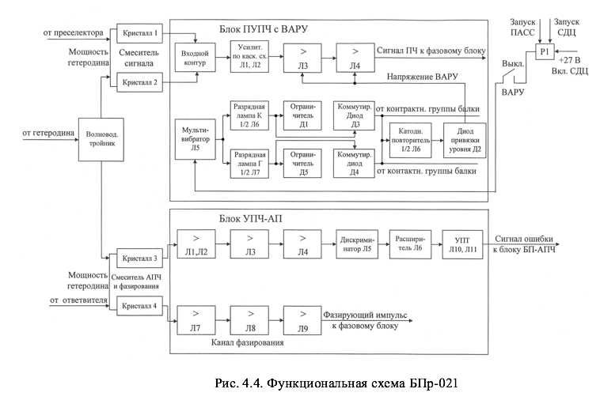
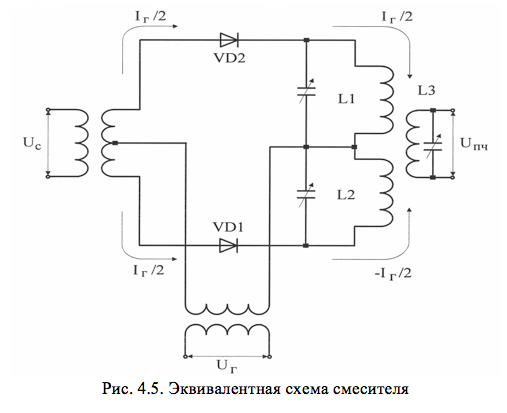
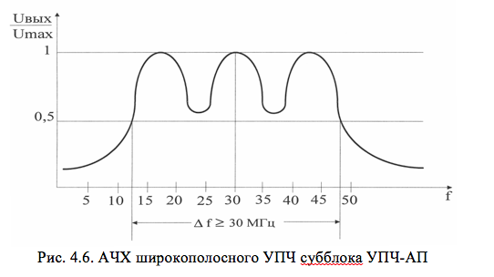
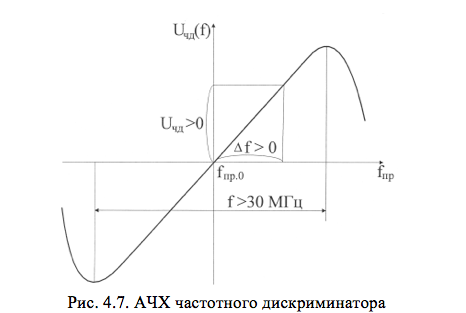
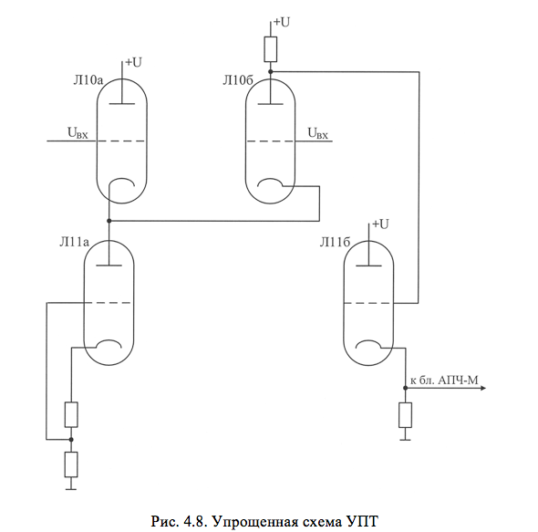

# БЛОК БПР-021

В состав блока входят:
 		- смеситель сигналов;
 		- смеситель АПЧ;
 		- субблок ПУПЧ с ВАРУ;
 		- субблок УПЧ-АП.

Функциональная схема блока приемника приведена на рис. 4.4.

В блоке приемника имеются два канала: канал предварительного усиления сигналов промежуточной частоты и канал автоматической подстройки частоты, в котором, кроме сигнала ошибки для подстройки частоты магнетронного генератора, формируется фазирующий импульс для когерентного гетеродина.

Каждый канал имеет собственный смеситель, на который подаются непрерывные колебания с блока гетеродина БГ-02 через волноводный тройник. Волноводный тройник служит для деления мощности гетеродина пополам. На вторые входы смесителей поступают импульсные радиосигналы: на смеситель сигнала – отраженные радиоимпульсы с преселектора, на смеситель АПЧ – ослабленные зондирующие импульсы магнетронного генератора.

С выхода смесителя сигнала радиоимпульсы промежуточной частоты поступают в канал предварительного усиления промежуточной частоты, включающей в себя четырехкаскадный УПЧ с ВАРУ. С выхода ПУПЧ сигналы промежуточной частоты подаются на фазовый блок для дальнейшей обработки. С выхода смесителя АПЧ импульсные сигналы промежуточной частоты поступают на субблок УПЧ-АП, состоящий из двух каналов: канала фазирования и канала АПЧ.

<b>Смесители сигналов и АПЧ</b>

Смесители сигналов и АПЧ идентичны по конструкции и служат для преобразования сигналов СВЧ в сигналы промежуточной частоты 30 МГц.

Эквивалентная схема смесителя изображена на рис.4.5.

Балансная схема построения смесителя сигналов позволяет исключить прохождение шумов гетеродина на его выход. Это связано с тем, что сигнал гетеродина, в отличие от отраженного сигнала, подается на смесительные диоды в фазе, и поэтому вызванные сигналом гетеродина токи в катушках L1 и L2 будут встречными и одинаковыми. Эти токи компенсируют друг друга, не увеличивая результирующий  коэффициент шума приемника.

С целью унификации приемника смеситель АПЧ выполнен также, как и смеситель сигнала, но не является балансным. С одного из диодов снимается сигнал для канала АПЧ, а с другого - для фазирования когерентного гетеродина.

<b>ПУПЧ с ВАРУ</b>

Субблок ПУПЧ с ВАРУ предназначен для предварительного усиления сигнала промежуточной частоты и автоматической регулировки коэффициента усиления приемника во времени для обеспечения постоянства амплитуды сигнала от цели на разных дальностях. Это способствует также ослаблению мощных сигналов от пассивных помех, предотвращая ввод приемника в режим насыщения.

Основные технические характеристики субблока ПУПЧ с ВАРУ:
		- коэффициент усиления на частоте 30 МГц – не менее 30;
		- полоса пропускания на уровне 0,7 – не менее 7 МГц.
		- принципиальная  схема  предварительного усилителя промежуточной частоты с ВАРУ  приведена в альбоме схем.

Субблок состоит из четырех каскадов усиления промежуточной частоты (лампы Л1 - Л4) и схемы ВАРУ (лампы Л5 - Л7). Сигнал промежуточной частоты, поступающий с выхода балансного смесителя, выделяется в настроенном на 30 МГц входном контуре и поступает на управляющую сетку лампы. Входной контур состоит из индуктивностей L1, L2, L3, намотанных на одном каркасе в одном направлении, и конденсаторов С7, С8, С11. Полоса пропускания контура выбрана равной 12…15 МГц для исключения влияния на полосу пропускания ПУПЧ. Такая полоса пропускания обеспечивается за счет шунтирующего действия внутренних сопротивлений кристаллических диодов балансного смесителя.

Для контроля работоспособности кристаллических диодов балансного смесителя производится измерение постоянной составляющей тока, протекающей через диоды. Чтобы напряжение сигнала промежуточной частоты не попадало на измерительный прибор, используются развязывающие цепочки, состоящие из дросселей Др1 - Др4 и конденсаторов С1 - С4.

Для уменьшения коэффициента шума ПУПЧ первые два каскада настроены по каскодной схеме («заземленный катод – заземленная сетка»). Достоинством такой схемы является низкий коэффициент шума. В качестве ламп каскодной схемы применены высокочастотные пентоды в триодном соединении. Применение в данной схеме триодов обусловлено тем, что триоды имеют в 3…5 раз меньший уровень шумов, чем пентоды. Недостатком триодов является относительно большая величина емкости сетка – анод, что может приводить к самовозбуждению усилителей. Конденсатор С15 изолирует управляющую сетку лампы Л1 от постоянного анодного напряжения и в то же время для напряжения высокой частоты представляет малое сопротивление, то есть по высокой частоте индуктивность L5 включена между анодом и катодом лампы Л2. Индуктивности L4 и L5 вместе с паразитными емкостями сетка – анод лампы Л1 и анод – катод лампы Л2  настраиваются на частоту 30 МГц и тем самым образуют фильтры – пробки для частоты 30 МГц, значительно уменьшающие обратную связь через паразитные емкости.

Предварительный усилитель промежуточной частоты выполнен по схеме «тройки» расстроенных контуров. Контуры в цепях анодов ламп Л2, Л3, Л4 образованы индуктивностями фильтров L6, L7, L8, паразитными емкостями монтажа и выходными и входными емкостями ламп. ширина полосы пропускания 7 МГц достигается за счет настройки контуров: в цепи анода лампы Л2 – на 33 МГц, в цепи анода лампы Л3 – на 27 МГц и в цепи анода лампы Л4 – на 30 МГц.

Требуемая полоса пропускания каждого контура достигается шунтированием этих контуров резисторами R5, R9 и R14, согласованием их с сопротивлениями соединительных кабелей. С нагрузки лампы Л4 сигнал поступает на высокочастотный разъем Ш3 и далее по соединительному кабелю на фазовый блок.

Регулировка усиления ПУПЧ осуществляется схемой ВАРУ. Схема ВАРУ состоит из ждущего мультивибратора – лампа Л5, разрядных ламп – левые половины ламп Л6 и Л7 и катодного повторителя – правая половина лампы Л6.

Запускающие импульсы положительной полярности амплитудой 40 В и длительностью 1 мкс с контакта 3б разъема Ш5 подаются на делитель, состоящий из резисторов R18 и R16, а с него – на запуск мультивибратора. В исходном состоянии левая половина лампы Л5 заперта за счет протекания тока правой половины лампы Л5 через общую катодную нагрузку R22, потенциал управляющей сетки правой половины лампы Л5 выше, чем потенциал управляющей сетки левой половины лампы Л5. Запускающий импульс отпирает левую половину лампы Л5, при этом мультивибратор формирует прямоугольный импульс, длительность которого определяется постоянной времени RС-цепи: R20, С38 – 200 мкс в режимах ПАСС, СДЦ или R20, С38, С36 – 400 мкс в режиме работы АКТ. При работе в активном режиме контактами реле Р1 параллельно конденсатору С38 подключается конденсатор С36.

С приходом отрицательного импульса мультивибратора на управляющие сетки разрядных ламп Л6а и Л7а они запираются, и конденсаторы С40 и С46 заряжаются через резисторы R25, R2 при работе антенны курса или R35, R13 – при работе антенны глиссады (R2, R13 расположены в блоке приемника). Величина сопротивления резисторов R2 и R13 определяет скорость заряда конденсаторов С40 и С46. Шлицы потенциометров R2 и R13 выведены на лицевую панель блока приемника и называются КРУТИЗНА К и КРУТИЗНА Г. Аноды разрядных ламп Л6а и Л7а поочередно, в такт работе антенны курса и глиссады, через резисторы R37 и R38 подключаются к корпусу, что определяет очередность заряда конденсаторов С40 и С46. Амплитуда напряжения заряда конденсаторов С40 и С46 ограничивается на определенном уровне с помощью диодов Д1 и Д5. На катоды диодов подается запирающее положительное напряжение, снимаемое с переменных резисторов R5 АМПЛИТУДА К или АМПЛИТУДА Г, расположенных в блоке приемника. При достижении пилообразным напряжением значения, равного напряжению запирания диода, последний открывается и дальнейший заряд конденсатора прекращается. По окончании импульса мультивибратора разрядные лампы  отпираются и конденсаторы С40, С46 быстро разряжаются через разрядные лампы. Пилообразные напряжения с конденсаторов С40, С46 поступают на управляющую сетку лампы Л6б, работающей в качестве катодного повторителя.

Выходное пилообразное напряжение с R33 подается на управляющие сетки ламп Л3 и Л4, в результате чего усиление ПУПЧ плавно изменяется от минимального (на малой дальности) до максимального (на максимальной дальности). 

Как видно из описания схемы, напряжение ВАРУ формируется неодинаково для каналов курса и глиссады. Это объясняется тем, что диаграммы направленности антенны курса и глиссады расположены в пространстве взаимно перпендикулярно и отражения от земной поверхности имеют преобладающее значение в канале глиссады. Закон изменения  напряжения ВАРУ по глиссаде устанавливают по результатам облета радиолокационной системы посадки с помощью переменных резисторов R1 – АМПЛИТУДА Г и R13 – КРУТИЗНА Г.

Выключение ВАРУ производится путем размыкания цепи запуска тумблером В1  ВАРУ–ВЫКЛ.

<b>УПЧ-АП</b>

Субблок УПЧ-АП предназначен:
		- для усиления фазирующих импульсов, подаваемых на когерентный гетеродин;
		- для получения сигнала ошибки схемы автоматической подстройки частоты МГ.

Технические данные субблока:
		- полоса пропускания канала фазирования – не менее 3 МГц;
		- коэффициент усиления канала фазирования на частоте 30 МГц – не менее 25;
		- несущая частота всех каналов – 30 МГц.

Принципиальная схема субблока УПЧ-АП приведена в альбоме схем.

Усилитель промежуточной частоты канала фазирования состоит из трех каскадов (Л7 - Л9), представляющих собой расстроенную тройку контуров. Входной контур (индуктивность L12) настроен на частоту 30 МГц.

На выходной разъем Ш3 подается только часть сигнала (с резистора R33) во избежание шунтирования выходного контура 50-омным коаксиальным кабелем, по которому фазирующий импульс подается на вход когерентного гетеродина.

Канал АПЧ состоит из УПЧ, дискриминатора, схемы расширения импульсов и усилителя постоянного тока (УПТ). Усилитель промежуточной частоты канала АПЧ состоит из четырех каскадов усиления (Л1 - Л4). Для получения полосы пропускания усилителя не менее 30 МГц при средней частоте 30 МГц применена специальная система настройки контуров. Индуктивности L2, L4, L5 образуют систему связанных контуров. Резонансная кривая этой системы имеет максимумы на частотах порядка 15 МГц и 45 МГц и минимум на частоте 30 МГц. Такую же систему связанных контуров образуют индуктивности L6, L7, L8. Контуры, образованные индуктивностями L1, L3, L9, настроены на частоту 30 МГц и шунтированы резисторами R1, R8, R14 для расширения полосы пропускания. Благодаря этим контурам устраняется провал на частоте 30 МГц в общей полосе пропускания усилителя (рис.4.6).

С выхода широкополосного УПЧ напряжение поступает на частотный дискриминатор. В ПРЛ-6М2, в отличие от ДРЛ-6М2, где применен дискриминатор с фазовым детектированием, используется балансный частотный дискриминатор с двумя расстроенными контурами. Величина расстройки контуров дискриминатора относительно средней частоты (fпр.о = 30 МГц) порядка 15 МГц (рис.4.7). 

С выхода дискриминатора импульсы сигнала ошибки поступают на схему расширения импульсов (Л6). Постоянные времени цепочек R21, С32 и R22, С34 выбраны порядка 1700 мкс. Благодаря этому на выходе схемы расширения получают растянутые импульсы, близкие по форме к постоянному напряжению. Напряжение с плеч схемы расширения импульсов подается на сеточный вход УПТ. На рис. 4.8 изображена эквивалентная упрощенная схема УПТ.

Применение в качестве нагрузки катодного повторителя триода Л11 (левая половина) позволяет получить катодный повторитель с хорошей линейностью во всем диапазоне входных сигналов. С выхода УПТ снимается разность двух напряжений. Использование в качестве входных клемм Л11б одновременно и сетки и катода позволяет повысить чувствительность УПТ.
 
Катодный повторитель, правая половина лампы Л11, позволяет привязать выходное напряжение УПТ к нулевому потенциалу. Резистор R40 КРУТИЗНА используется при настройке субблока для выбора одинакового уровня ограничения обеих ветвей дискриминационной характериcтики и одинаковой крутизны ветвей (рис. 4.7).

Начальным уровнем служит нулевой потенциал относительно корпуса, который устанавливается с помощью переменного резистора R46 УРОВЕНЬ. Для регулировки величины выходного сигнала служит переменный резистор R1 УСИЛЕНИЕ АПЧ, установленный на лицевой панели блока приемника за дверцей. Сигнал ошибки с выхода УПТ через контакт 6б разъема Ш5 подается на блок АПЧ-М.

Конденсаторы С1, С2, С3 и С36, С37, С38, дроссели Др1, Др2 и Др4, Др5 служат для фильтрации переменной составляющей тока кристалла. Постоянная составляющая тока кристалла через дроссели Др1, Др2 и Др4, Др5 подается на измерительный прибор, расположенный на лицевой панели блока приемника.