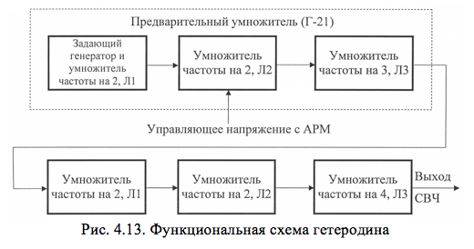

# БЛОК ГЕТЕРОДИНА БГ-02

Блок гетеродина  предназначен для генерирования непрерывных стабилизированных кварцем колебаний, подаваемых на смесители сигналов и АПЧ.

Технические данные блока: 
- количество фиксированных рабочих  частот – 6; 
- время перестройки с одной фиксированной частоты на другую    не более 30 мин; 
- выходная мощность на любой из частот – не менее 6 мВт.

В состав блока гетеродина входят:
- гетеродин; 
- субблок автоматической регулировки мощности (САРМ); 
- выпрямители:  –125 В 75 мА, +150 В 70 мА; +250 В 190 мА.

<b>Гетеродин</b>

Гетеродин построен по схеме Шембеля – последовательного умножения частоты кварцевого генератора в шести каскадах. Схема Шембеля  обеспечивает минимальную зависимость частоты генератора от нагрузки. Функциональная схема гетеродина представлена на рис. 4.13.
Общий коэффициент умножения равен произведению коэффициентов умножения отдельных каскадов  КУМН= К1 К2 К3 К4 К5 К6 =2x2x3x2x2x4=192. Первые три каскада выполнены в виде отдельного субблока (предварительный умножитель). В предварительном умножителе происходит возбуждение высокочастотных колебаний и умножение их частоты в 12 раз. Принципиальная схема гетеродина приведена в альбоме схем.

Первый каскад предварительного умножителя (кварцевый
генератор) выполнен на лампе Л1 и представляет собой одну из разновидностей схем с электронной связью. В таких схемах различают внутреннюю часть, в которой непосредственно  возбуждаются колебания, и внешнюю, которая передает эти колебания в нагрузку. Связь между обеими частями схемы осуществляется через электронный поток лампы.

Внутренняя часть схемы выполнена с кварцем в контуре.  С целью исключения возникновения помех от гетеродина применены кварцы с более высокой частотой, чем промежуточная. Такие кварцы возбуждаются на третьей гармонике. Индуктивное сопротивление кварцев при этом мало и не всегда достаточно для выполнения  условий самовозбуждения. Чтобы увеличить индуктивное сопротивление ветви контура с кварцем и надежно обеспечить возбуждение кварцев на требуемых частотах, в схему включена индуктивность L1. Резистор R1 шунтирует кварц для исключения возможных паразитных колебаний. Конденсаторы С2 и С4 являются конденсаторами обратной связи.

Во внешней части схемы включен контур, состоящий из элементов L2, C5, настраиваемый на вторую гармонику генерируемой частоты, в результате чего происходит умножение частоты задающего генератора в 2 раза в первом же каскаде.

Второй каскад собран на лампе Л2. Напряжение смещения на управляющей сетке – комбинированное. Часть напряжения смещения образуется за счет катодного тока (автосмещение). Другая часть напряжения смещения вводится в цепь сетки в виде управляющего напряжения. Этим достигается регулирование уровня мощности гетеродина.

В режиме автоматического регулирования мощности управляющее напряжение вырабатывается схемой АРМ, а в режиме ручной регулировки поступает от источника питания минус 125 В через делитель R1, R2. Регулирующий резистор R2 РРМ вынесен на 
лицевую панель блока гетеродина. Переключение из режима АРМ в режим РРМ осуществляется с помощью переключателя В3, вынесенного также на лицевую панель блока гетеродина.
Колебательная система второго каскада состоит из короткозамкнутого коаксиального резонатора У1 и подстроечного конденсатора С14. Она настроена на четвертую гармонику генерируемого колебания. Передача мощности из второго каскада в третий происходит через конденсатор связи С15.
Третий каскад работает в режиме утроения частоты. Анодная нагрузка представляет собой коаксиальный резонатор. Подстройка резонатора осуществляется с помощью двух конструктивных емкостей С17 и С18. Вывод энергии  индуктивный - с помощью петли связи, закрепленной на конце коаксиального кабеля. Падение напряжения на резисторе R10 измеряется контрольным прибором ИП-1 КОНТРОЛЬ РЕЖИМОВ, размещенным на лицевой панели блока гетеродина (в положении «ТОК ПР. УМН.» переключателя В1).

Четвертый и пятый каскады выполнены на лампах Л1, Л2. Оба каскада работают в режиме удвоения частоты, что обеспечивается настройкой их контуров на соответствующую частоту. Подстройка анодно-сеточного контура 4-го каскада ёмкостная, вывод энергии индуктивный с помощью петли связи. Подстройка анодно-сеточного контура 5-го каскада ёмкостная, вывод энергии осуществляется емкостным зондом. 

Шестой (выходной) каскад работает в режиме учетверения частоты. Катодно-сеточная часть каскада выполнена в виде настраиваемого конструктивной емкостью коаксиального резонатора. Вывод энергии осуществляется емкостным зондом. Анодно-сеточный резонатор представляет собой отрезок волновода стандартного сечения. Настройка осуществляется короткозамыкающим контактным поршнем, а согласование с нагрузкой – с помощью двух реактивных штырей.
Падение напряжения на резисторах R2, R4 и R6 измеряется контрольным прибором ИП-1 КОНТРОЛЬ РЕЖИМОВ в положениях переключателя В1 «ТОК II УМН.»,  «ТОК III УМН.» и «ТОК ОУ» соответственно.
Для перестройки гетеродина на другую фиксированную частоту необходимо произвести замену кварца в задающем генераторе и подстройку объемных высокочастотных контуров согласно инструкции по эксплуатации.

