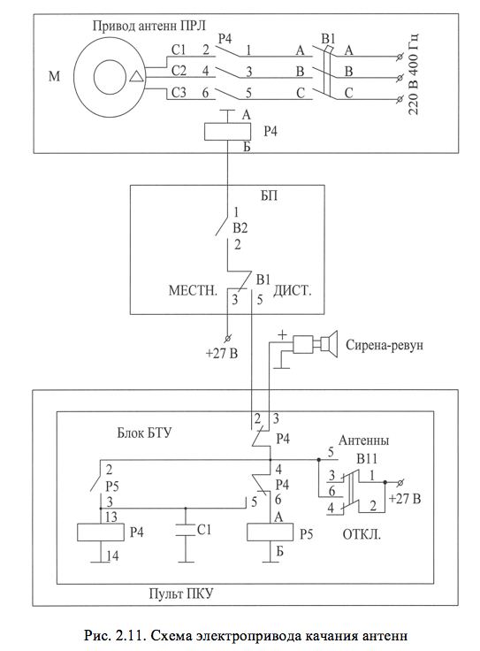

# ЭЛЕКТРОПРИВОД КАЧАНИЯ АНТЕНН

Электропривод качания предназначен для качания антенн курса в азимутальной плоскости  и антенны глиссады в вертикальной плоскости.

В состав его входят следующие элементы (рис.2.11):
 		- асинхронный двигатель М привода ПРЛ;
 		- автоматический выключатель В1 и контактор Р4, расположенные в блоке привода антенн ПРЛ;
 		- тумблер дистанционного включения привода качания антенн ПРЛ  АНТЕННЫ (В11), размещенный на передней панели блока БТУ (рис.1.7);
 		- устройство звуковой сигнализации – сирена; 
 		- блок блокировки привода (БП).

При включении тумблера В11 замыкается цепь звуковой сигнализации, предупреждающей о включении привода, замыкается цепь питания реле времени Р4 в БТУ. Длительность звукового сигнала определяется временем срабатывания реле Р4 и составляет около 20 с. При срабатывании реле Р4 звуковая сигнализация отключается. Напряжение +27 В через контакты реле Р4 подается на обмотку контактора Р4, на мощные контакты которого с автомата  защиты В1 подведено трехфазное напряжение 220 В 400 Гц. После включения контактора напряжение 220 В 400 Гц подается на двигатель привода М.

