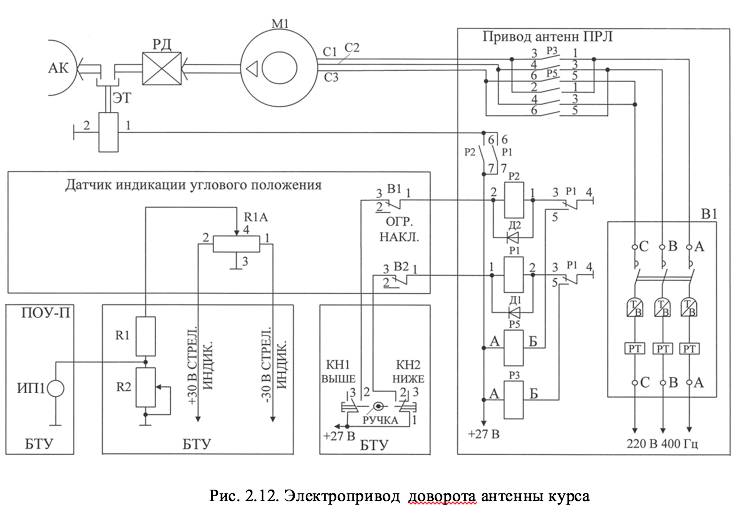

# ЭЛЕКТРОПРИВОД НАКЛОНА АНТЕННЫ КУРСА

Электропривод наклона антенны курса предназначен для наклона антенны курса по углу места в пределах от –1&deg; до +8&deg;.

В состав электропривода входят следующие устройства (рис.2.12):
 		- асинхронный двигатель М (типа АОП-21-12) с редуктором (РД) и электротормозом (ЭТ);
 		- контакторы Р3 и Р5 с блокировочными реле Р1 и Р2, установленные в приводе антенн ПРЛ;
 		- кнопки Кн1 и Кн2, ручка панели оперативного управления антеннами ПРЛ на БТУ;
 		- микровыключатели ограничения наклона В1 и В2, размещенные в блоке датчика индикации положения антенны.

При нажатии ручки панели оперативного  управления антенн (рис.1.7) в положение ВЫШЕ срабатывает кнопка Кн1. Напряжение +27В с Кн1 поступает через замкнутые контакты микровыключателя В1 блока датчика индикации на обмотку реле Р2 привода антенн ПРЛ. Реле Р2 контактами 7-6 замыкает цепь подачи напряжения +27 В на электротормоз. Наклон антенны осуществляется все время, пока нажата ручка на панели  оперативного управления антеннами.

При нажатии ручки панели оперативного управления антенн в положение НИЖЕ работа схемы аналогична, но с использованием  кнопки Кн2, микровыключателя В2, реле Р1 и контактора Р5. При этом переключаются две фазы питающего двигатель М1 напряжения и двигатель вращается в обратную сторону.

Контроль и визуальное наблюдение за положением антенн курса обеспечивает система потенциометрической передачи угла наклона, содержащая:
 		- потенциометрический датчик индикации угла наклона антенны курса R1А, установленный в блоке датчика индикации положения антенны;
 		- прибор стрелочной индикации положения антенны курса ИП1, установленный на передней панели пульта оперативного управления (ПОУ-П) (рис.1.7).

От стабилизированного выпрямителя на потенциометр R1А подается питание +30 В. Средняя точка потенциометра заземлена. Движок потенциометра связан с осью наклона антенны курса. Таким образом, при наклоне антенны с движка снимается напряжение пропорциональное углу наклона. Измерительный прибор отградуирован в градусах угла наклона (от –10 до +90).
Электропривод доворота антенны глиссады аналогичен рассмотренному выше приводу наклона антенны курса (рис.2.13).
