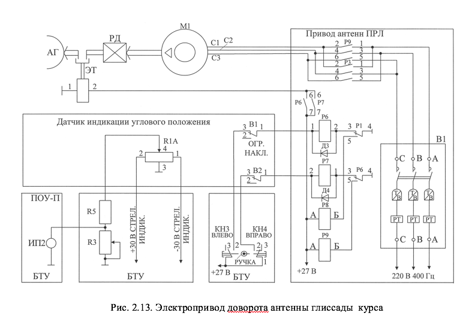
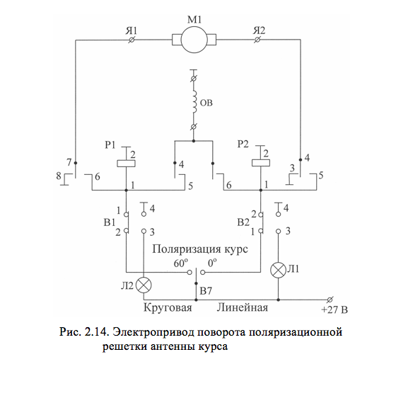

# ЭЛЕКТРОПРИВОД ПОВОРОТА ПОЛЯРИЗАЦИОННЫХ РЕШЕТОК АНТЕНН КУРСА И ГЛИССАДЫ

Электроприводы поворота поляризационных решеток предназначены для поворота решеток относительно облучателей антенн на угол от 0&deg; до 60&deg;. В состав электропривода поляризационных решеток входят (рис.2.14): 
 		- электродвигатель постоянного тока М1;
 		- два концевых микровыключателя В1, В2, служащих для  ограничения угла поворота от 0&deg; до 60&deg;;
 		- цепи коммутации.

Управление приводом поворота осуществляется переключателем В7, расположенным на панели ПОУ-П (рис.1.7). При установке переключателя В7 в положение ЛИНЕЙНАЯ напряжение +27 В через контакты 1,2 В2 подводится к реле Р2. Сработав, Р2 контактами 6,8 подключает +27 В к обмотке возбуждения (ОВ) двигателя М1, а контактами 5,4 – к якорной обмотке (вывод Я2). двигатель начинает поворачивать поляризационную решетку. При достижении заданного угла поворота срабатывает микровыключатель В2. Контактами 1,2 он разрывает цепь питания двигателя М1, а контактами 3,4 подключает корпус к лампочке Л1, сигнализирующей о виде поляризации (линейная). При установке В7 в положение КРУГОВАЯ схема срабатывает аналогично, но по другой цепи: +27 В через контакты В7, 1,2 В1 поступает на реле Р1, оно срабатывает и подключает обмотку возбуждения и якорную обмотку (вывод Я1). двигатель начинает вращаться в противоположную сторону. Далее протекают процессы, аналогичные описанным выше.
        

