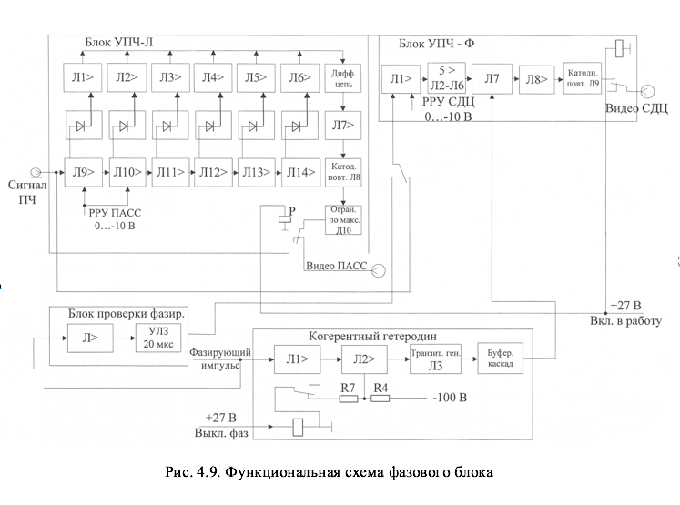
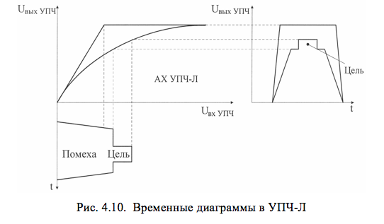
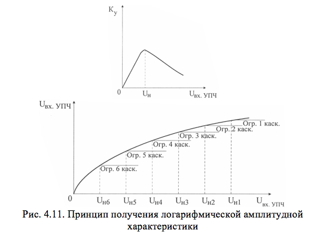
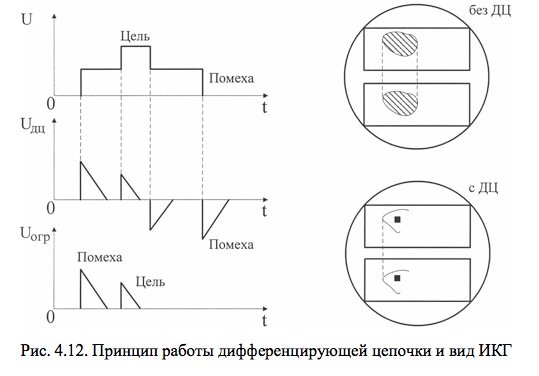

# ФАЗОВЫЙ БЛОК БФ-02

Фазовый блок предназначен для усиления по промежуточной частоте отраженных сигналов, поступающих с ПУПЧ, и преобразования их в видеоимпульсы.

Технические данные блока:
		- промежуточная частота – 30 МГц;
		- полоса пропускания не менее – 4,5 МГц;
		- коэффициент усиления по амплитудному и фазовому каналам – не менее 500;
		- частота колебаний когерентного гетеродина – 30 МГц.

В состав фазового блока входят:
		- субблок УПЧ-Л;
		- субблок УПЧ-Ф;
		- когерентный гетеродин;
		- блок проверки фазирования (БПФ).

Функциональная схема фазового блока приведена на рис. 4.9.

<b>УПЧ-Л</b>

Субблок УПЧ-Л предназначен для усиления и амплитудного детектирования сигналов промежуточной частоты в режимах ПАСС и АКТ.

Амплитудная характеристика субблока УПЧ-Л является логарифмической (рис.4.10). Динамический диапазон сигналов на входе приемника порядка 50…70 дБ (по мощности). Применяемый в данном случае УПЧ с логарифмической характеристикой ограничивает только достаточно большие сигналы, превышающие уровень собственных шумов на 50…60 дБ. Таким образом, сигнал от самолета, находящегося на фоне местного предмета или гидрометеора, не будет ограничен. в случае применения линейного УПЧ полезный сигнал будет ограничен.

УПЧ-Л построен по схеме сложения напряжений видеоимпульсов с выходов усилительных каскадов, имеющих отдельные амплитудные детекторы. Принципиальная схема УПЧ-Л приведена в альбоме схем.

Усилитель промежуточной частоты состоит из 6 каскадов, выполненных на пентодах с двумя анодами (Л9 - Л14). С одного из анодов сигнал подается на следующий каскад усиления, со второго анода – на амплитудный детектор. После детектирования видеосигналы поступают на каскады видеоусиления и сложения (Л1 - Л6). В качестве сумматоров используется линия задержки, реализованная на Др1 - Др14 и междуэлектродных емкостях ламп.

Каждый в отдельности каскад УПЧ является линейным усилителем. С ростом напряжения на входе он входит в режим насыщения. Если рассматривать УПЧ в целом, то с ростом входного напряжения на управляющей сетке лампы Л9 вначале войдет в режим насыщения последний каскад УПЧ (Л14). При дальнейшем росте входного напряжения будут поочередно входить в режим насыщения все предыдущие каскады – Л13, Л12, Л11, Л10 и, наконец, Л9. При этом выходное напряжение в канале видеоусиления и сложения будет возрастать до тех пор, пока не войдет в режим насыщения каскад, построенный на лампе Л9. Дальнейший рост входного напряжения не приведет к увеличению сигнала на выходе УПЧ.

Процесс формирования логарифмической амплитудной характеристики УПЧ-Л поясняется на рис.4.11.
Результирующая амплитудная характеристика усилителя, получаемая в результате сложения напряжений, снимаемых с анодов ламп видеоусилителей Л1 - Л6, близка к логарифмической. Между каскадами видеоусилителей включены звенья линии задержки. Время задержки каждого звена линии выбрано равным времени задержки сигнала при прохождении им одного каскада УПЧ. Это необходимо для совмещения видеоимпульсов при сложении их на общей нагрузке R1, R21.

Полоса пропускания каждого каскада УПЧ равна 4…5 МГц и определяется полосой пропускания контуров, образованных индуктивностями L1, L3, L5, L7, L9, L11. Контуры L2, L4, L6, L8, L10 имеют широкую полосу пропускания (не менее 7 МГц), что достигается подбором величины связи между обмотками контуров.

Сигнал с анодов ламп канала видеоусиления и сложения проходит через дифференцирующую цепочку R20, С14, постоянная времени которой меньше длительности сигнала, отраженного от самолета. Сигналы, отраженные от целей, протяженных местных предметов и гидрометеоров, имеющие большую длительность, дифференцируются. Получаемые в результате дифференцирования отрицательные выбросы ограничиваются диодом Д7. Таким образом, от местных предметов и гидрометеоров на экране индикатора остается только лишь передняя кромка, что позволяет выделять метку цели на «шумовом» фоне пассивных отражений (рис.4.12).

После усиления в каскадах видеоусилителя (два каскада на лампе Л7) сигналы положительной полярности поступают на катодный повторитель (Л8) и с его нагрузки R30 на выход субблока. Резисторы R27, R29 являются антипаразитными и служат для предотвращения возможности самовозбуждения катодного повторителя. чтобы амплитуды выходных сигналов не превышали значения 8,5 В (необходимо для работы индикаторных устройств), на выходе катодного повторителя включен ограничитель на кремниевом стабилитроне Д814А (диод Д10).

<b>УПЧ-Ф</b>

Субблок УПЧ-Ф предназначен для усиления сигналов промежуточной частоты, поступающих с ПУПЧ в режиме селекции движущихся целей. На фазовом детекторе субблока производится сравнение фаз отраженного и зондирующего сигналов, в результате чего на его выходе формируются видеоимпульсы определенной амплитуды и полярности, зависящие от разности фаз этих сигналов. Видеоимпульсы с выхода УПЧ-Ф подаются на компенсирующее устройство.

Принципиальная схема УПЧ-Ф приведена в альбоме схем.
Субблок УПЧ-Ф состоит из 6 каскадов усиления промежуточной частоты (лампы Л1 - Л6), фазового детектора (лампа Л7), видеоусилителя (лампа Л8) и катодного повторителя (лампа Л9). Смещение на сетках всех ламп усилителя автоматическое. Ручная регулировка усиления производится путем подачи отрицательного напряжения на управляющую сетку лампы Л1.

Два первых каскада усиления являются усилителями с линейной амплитудной характеристикой, четыре последующих каскада образуют усилитель с ограничением. Ограничение необходимо для того, чтобы исключить зависимость напряжения на выходе фазового детектора от величины входного сигнала. Ограничение в усилителе осуществляется за счет подачи пониженного до 75 В экранного напряжения на лампы Л3 - Л5. В качестве анодной нагрузки каскадов используются связанные контуры. Средние частоты настройки контуров следующие: L1  32 МГц; L2 28 МГц; L3  32 МГц; L4  28 МГц; L5, L6  30 МГц.

На фазовый детектор, построенный на лампе Л7, подаются одновременно два напряжения: напряжение с последнего каскада УПЧ и опорное напряжение с когерентного гетеродина, сфазированное зондирующими импульсами магнетронного генератора.

Резистор R33 служит для согласования со входом фазового детектора волнового сопротивления коаксиального кабеля, по которому подается опорное напряжение от когерентного гетеродина.

При настройке субблока УПЧ-Ф и проверке полосы пропускания необходимо переключать фазовый детектор в режим амплитудного детектирования. Для этого анод правой половины лампы Л7 заземляется с помощью контактов реле Р1 при установке тумблера В2 «ФД-АД» на лицевой панели блока БФ-02 в положение «АД».

Видеоимпульсы обеих полярностей с выхода фазового детектора подаются на вход видеоусилителя (Л8) с отрицательной обратной связью. Видеоусилитель должен усиливать в линейном режиме видеоимпульсы как положительной, так и отрицательной полярности. Коэффициент усиления регулируется с помощью переменного резистора R41. Усиленные видеоимпульсы поступают на катодный повторитель (Л9), основное назначение которого состоит в согласовании высокоомного выхода видеоусилителя с  волновым сопротивлением (150 Ом) кабеля, по которому видеосигнал подается на компенсирующее устройство.

<b>Когерентный гетеродин</b>

Когерентный гетеродин предназначен для генерирования непрерывных колебаний промежуточной частоты, фазируемых зондирующими импульсами магнетронного генератора. Принципиальная схема гетеродина приведена в альбоме схем.

Когерентный гетеродин состоит из двух каскадов усиления фазирующих импульсов (лампы Л1, Л2), транзитронного генератора (лампа Л3) и буферного усилительного каскада (лампа Л4).

Фазирующий импульс с блока приемника поступает по коаксиальному кабелю на управляющую сетку лампы Л1. Смещение 1-го и 4-го каскадов автоматическое, 2-го – фиксированное. Напряжение смещения на управляющую сетку лампы Л2 подается с делителя напряжения R4, R7 и выбрано таким образом, чтобы произвести отсечку паразитных сигналов и шумов в целях предотвращения несанкционированного фазирования гетеродина. Усиленный двухкаскадным усилителем фазирующий импульс поступает на колебательный контур генератора. Генератор собран на транзитронной схеме. Колебательный контур, состоящий из индуктивности L2 и конденсаторов С11, С12, С14, включен между антидинатронной сеткой и катодом лампы Л3 за счет наличия  конденсатора С21.

Генерация  в транзитронной схеме возникает за счет того, что при определенных напряжениях на антидинатронной и экранирующей сетках пентода промежуток катод  экранирующая сетка имеет отрицательное сопротивление. Это сопротивление компенсирует потери в контуре, в результате чего обеспечивается возникновение в контуре незатухающих колебаний. Передача изменения напряжения экранирующей сетки на антидинатронную осуществляется через конденсатор С20. Подстройка генератора по частоте осуществляется с помощью подстроечного конденсатора С14. Колебания, вырабатываемые генератором, усиливаются буферным усилителем на лампе Л4 и подаются на вход фазового детектора субблока УПЧ-Ф.

В субблоке когерентного гетеродина предусмотрена возможность выключения фазирования при помощи реле Р, на которое подается напряжение +27 В с блока технического управления при установке тумблера ФАЗИРОВАНИЕ-ВЫКЛ. в положение «ВЫКЛ». С помощью реле Р делитель  на резисторах R4, R7 отключается от корпуса и на сетку лампы Л2 поступает напряжение минус 105 В. В этом случае фаза зондирующего импульса когерентному гетеродину не навязывается, и он генерирует колебания со случайной фазой.

