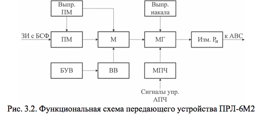
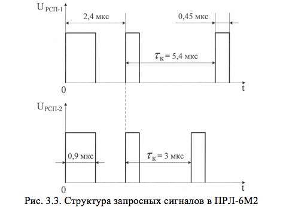
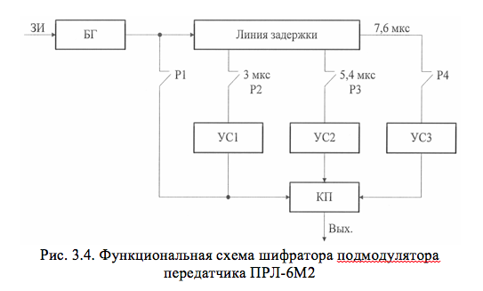
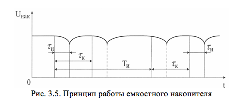
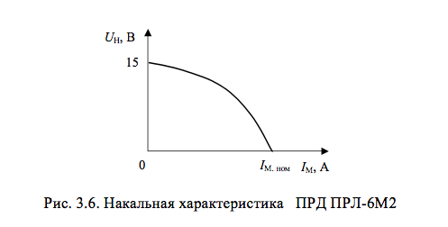

# ФУНКЦИОНАЛЬНАЯ СХЕМА ПЕРЕДАЮЩЕГО УСТРОЙСТВА ПРЛ-6М2

Функциональная схема передающего устройства ПРЛ-6М2 приведена на рис.3.2. Подмодулятор запускается импульсами с блока БСФ. В режимах ПАСС, СДЦ, СДЦ+ПАСС подмодулятор формирует одиночные ЗИ длительностью 0,45 мкс для запуска модулятора. В активном режиме ПМ ПРД-1 формирует кодированную пару импульсов в зависимости от режима запроса: РСП-1, РСП-2. Их временная структура приведена на рис.3.3. В режиме УВД запросные импульсы формируются с чередованием по курсу (РСП-1) и глиссаде (РСП-2), соответственно.

Первым запускается ПРД-2, который формирует одиночный импульс длительностью 0,9 мкс – импульс подавления, вторым – передатчик секторного обзора. Задачу формирования запросных сигналов с различными кодовыми интервалами в передатчике ПРЛ-6М2 решает шифратор. Шифратор функционально размещается в ПМ. Принцип работы шифратора ПМ поясняется рис.3.4.

В АКТ режиме в шифраторе запускается блокинг-генератор (БГ), который  формирует импульс длительностью 0,45 мкс. Включение режимов РСП-1, РСП-2 приведет к  срабатыванию реле Р2 или Р3. В режиме УВД реле Р2 и Р3 срабатывают поочередно. Совместная работа ПРД-1 и ПРД-2 в режиме АКТ с подавлением позволяет в самолетном ответчике осуществить эффективное подавление ложных ответных сигналов, которые могут быть приняты по боковым лепесткам основной диаграммы направленности АК и АГ. Кроме того, возможно формирование подгрузочного кода с базой 7,6 мкс, который используется в интервале времени коммутации антенн курса и  глиссады. Реле Р1 служит для отключения шифратора при работе ПРД-2 вместо ПРД-1 в режимах ПАСС, СДЦ, СОВМ. Включение режимов РСП-1, РСП-2, УВД производится на передней панели блока БМП-021.

Модулятор собран по схеме с частичным разрядом емкостного накопителя, аналогичной передатчику ДРЛ-6М2. Это позволяет реализовать режим кодированного запроса без изменения параметров каждого из пары импульсов. Кроме того, практическое постоянство амплитуд высоковольтных импульсов модулятора позволяет обеспечить неизменность частоты магнетронного генератора (рис.3.5).

Магнетронный генератор (МГ) типа МИ-99 пакетированного типа, т.е. магнитная система и магнетрон конструктивно выполнены в виде единой конструкции. Для перестройки магнетронного генератора могут использоваться грубая ручная схема перестройки на одну из 6 фиксированных частот в диапазоне 400 МГц, а также схема автоматической подстройки частоты (АПЧ). Точность ручной перестройки &sigma;fмг=&plusm;5 МГц, автоматической - &sigma;fАПЧ=&plusm;100 кГц. 

Достаточно высокая точность автоподстройки частоты позволяет в приемнике уменьшить потери на несогласованность полосы пропускания УПЧ и ширины спектра обрабатываемого сигнала:

В системах с низкой &sigma;fАПЧ потери в приемнике &alfa;пУПЧ>>1, так как необходимо расширять полосу пропускания УПЧ.

Напряжение накала в магнетронном генераторе может изменяться в диапазоне от 0 до 15 В в зависимости от подводимой к нему мощности. Так как ток высоковольтного выпрямителя связан с подводимой к МГ мощностью, то по среднему значению этого тока можно судить о генерируемой мощности МГ. По мере роста тока IМ напряжение накала UН уменьшается (рис.3.6).

БУВ-21 обеспечивает стабилизацию переменного напряжения запитки высоковольтного выпрямителя при пульсациях напряжения в сети (от АД-30, ВПЛ-30), а также защиту высоковольтного выпрямителя при возникновении перегрузок в МГ (напри-мер, высоковольтный разряд). При этом высокое напряжение с МГ снимается. При исчезновении перегрузки подача высокого напряжения с высоковольтного выпрямителя на МГ возобновляется.

Как и ДРЛ-6М2, в ПРД ПРЛ-6М2 для контроля проходящей мощности используется датчик на основе термопар, выходной ток которого пропорционален РСР, а значит, и РИ, т.к. РИ=РСРQ. Поэтому стрелочный прибор (индикатор мощности) на двери СП-02 проградуирован в единицах импульсной мощности.

