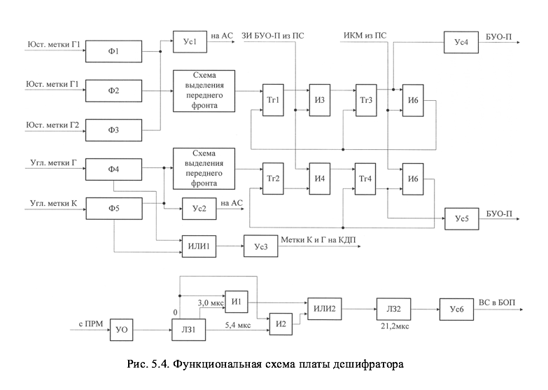
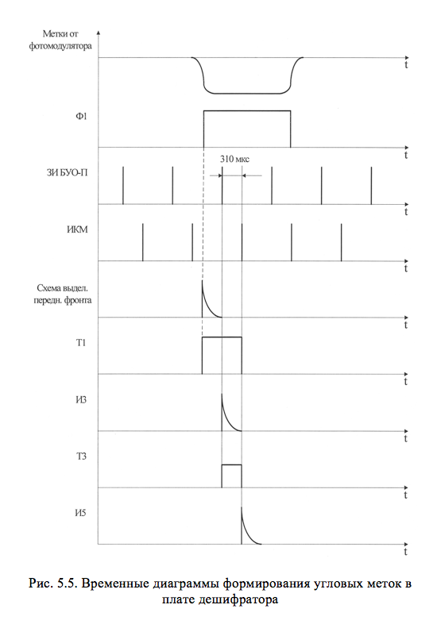
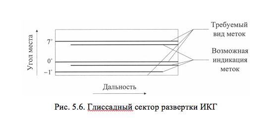
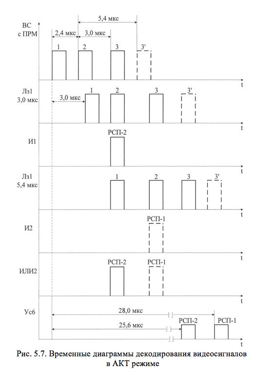

# ФУНКЦИОНАЛЬНАЯ СХЕМА ПЛАТЫ ДЕШИФРАТОРА

Плата дешифратора обеспечивает декодирование отраженных видеосигналов (ВС) с выхода приемника при работе посадочного радиолокатора в АКТ режиме с подавлением и без подавления, а также формирование угловых меток для индикатора курса и глиссады, аппаратуры сопряжения (АС) и выносного индикатора системы посадки ВИСП-75 на КДП. Функциональная схема платы дешифратора приведена на рис.5.4. Верхняя часть схемы обеспечивает формирование угловых меток курса (К) и глиссады (Г), начало которых жестко связано с моментом запуска разверток на ИКГ в секторах каналов курса и глиссады. Так как принцип их формирования в каналах К и Г аналогичен, то рассмотрим пример формирования угловой глиссадной метки Г1 по временным диаграммам, представленным на рис.5.5. Форма и временное положение сигналов меток с выхода фотомодулятора антенного устройства таковы (на входе формирователя Ф2), что если подать их без преобразования в схеме формирования угловых меток на ЭЛТ, то их временное положение (начало) не соответствует началу равертки, а длительность не равна длительности установленного масштаба развертки (20 или 40 км), как показано на рис.5.6.

В результате обработки сигналов в данной схеме на выходе усилителя 4 (УС4) формируется видеоимпульс, начало которого привязано к импульсу запуска развертки (ЗИ БУО-П), а окончание – к импульсу конца масштаба (ИКМ). длительность выходных импульсов равна 310 мкс, что не превышает периода повторения импульсов ПРЛ и обеспечивает засветку только одной линии развертки по дальности.

В нижней части схемы платы дешифратора приведена схема декодирования отраженных видеосигналов с выхода приемника первичного канала при работе посадочного радиолокатора в АКТ режиме. На рис.5.7 приведены временные диаграммы, поясняющие принцип декодирования отраженных сигналов в АКТ режиме с подавлением. В режиме АКТ без подавления принцип работы схемы аналогичен. Видеосигналы с приемника во входном усилителе-ограничителе нормализуются по амплитуде. Декодирование отраженных сигналов в режиме запроса РСП-2 сигналов с кодовым интервалом &tau;к=3 мкс выполняется в схеме И1, на входы которой поступают видеосигналы с отводов «0» и «3 мкс» линии задержки Лз1, а в режиме РСП-1 (с кодовым интервалом &tau;к=5,4 мкс импульсы 3 показаны пунктиром) – в схеме И2. При этом на выход дешифратора (усилитель УС6) декодированные видеоимпульсы РСП-1 будут поступать с задержкой на 28 мкс, что необходимо для их совмещения во времени с декодированными ответными сигналами самолетного ответчика. В режиме РСП-2 эта задержка должна составлять 25,6 мкс.

