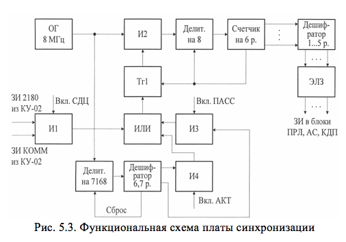

# ФУНКЦИОНАЛЬНАЯ СХЕМА ПЛАТЫ СИНХРОНИЗАЦИИ

Плата синхронизации обеспечивает формирование запускающих импульсов, приведенных в п. 5.1, в трех режимах работы посадочного радиолокатора. В режиме СДЦ запускающие импульсы формируются в ПС из импульсных последовательностей ЗИ КОММ и ЗИ 2180, поступающих из КУ-02. Задачей платы в этом режиме является обеспечить необходимую задержку ЗИ в соответствии с временными диаграммами (рис.5.1). Запускающие импульсы из КУ-02 поступают на вход схемы И1 (рис.5.3). 

При наличии команды ВКЛ. СДЦ эти ЗИ через схему ИЛИ переведут триггер Тг1 в состояние «1», выходной сигнал которого отпирает вентиль И2 для импульсных сигналов опорного генератора с частотой FОП=8 МГц. На выходе делителя на «8» будет последовательность импульсов с частотой FИ=1 МГц, что соответствует периоду повторения ТИ=1 мкс. Счетчик на шесть разрядов и пять дешифраторов состояний счетчика выполняют функцию многоотводной (на 5 отводов) цифровой линии задержки (время задержки обеспечивается с точностью до целых микросекунд). Блок аналоговых электрических линий задержки (ЭЛЗ) обеспечивает подбор необходимой задержки с точностью до десятых долей микросекунды. Сигнал 6-го разряда счетчика переводит счетчик, делитель Т1 в состояние «0», подготавливая схему к очередному циклу.
В ПАСС или АКТ режиме первоначально ЗИ с частотой FИ=2180 Гц (ТИ=458 мкс) или FИ=1090 Гц (ТИ=916 мкс) формируются на выходе дешифратора состояния 6-го и 7-го разрядов, на вход которого поступают поделенные на 7168 импульсы опорного генератора. Эти импульсы через схемы И3 или И4, при наличии команд включения режима ПАСС или АКТ, поступают на описанную выше схему задержки. 

