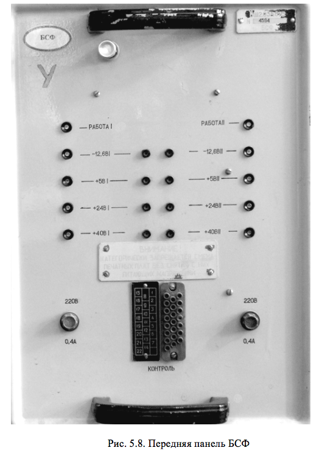

# КОНСТРУКЦИЯ БЛОКА СИНХРОНИЗАЦИИ И ФОРМИРОВАНИЯ

БСФ собран на типовом шасси (рис.5.8). Конструкция блока позволяет выдвигать его из стойки и поворачивать на одной из двух пар упоров, обеспечивает доступ к монтажу при проведении профилактических работ и ремонта. На передней панели размещены элементы индикации и контроля (световая индикация выбора в работу номера комплекта (РАБОТА I, РАБОТА II) и наличия выходных напряжений стабилизаторов). Монтаж элементов устройств обработки и формирования сигналов выполняется на односторонних печатных платах. Трансформаторы питания, элементы выпрямителей и коммутации собраны на отдельных платах. Подключение блока к стойке ПРЛ с помощью трех колодок типа РП14-30. 

