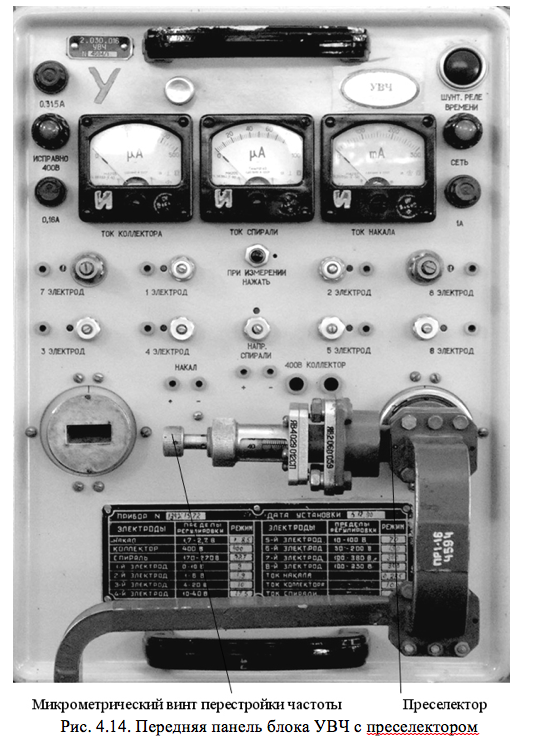
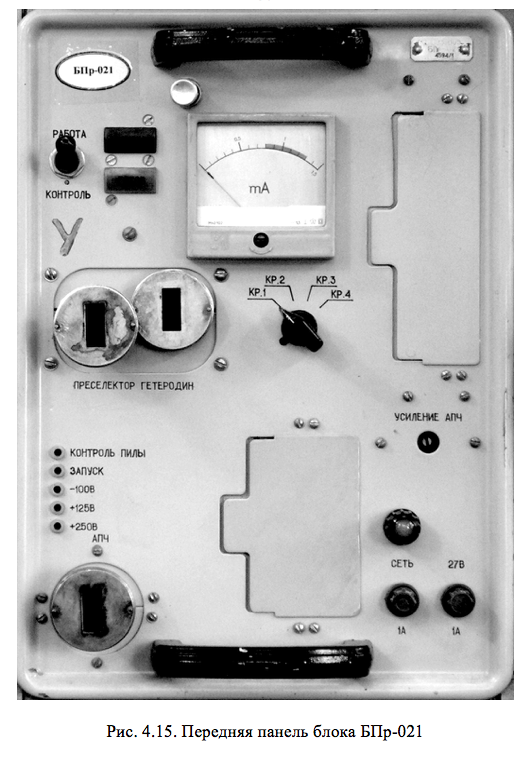
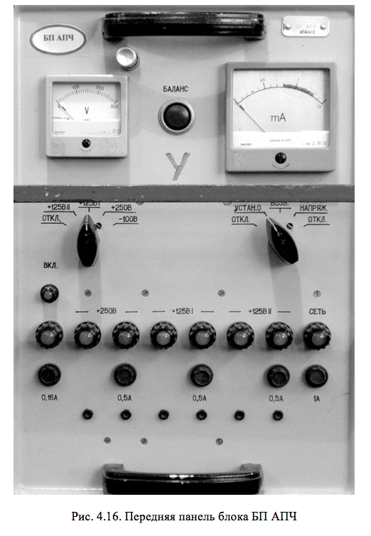
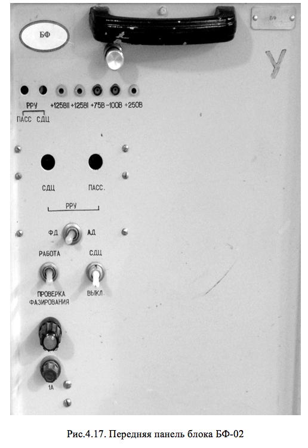
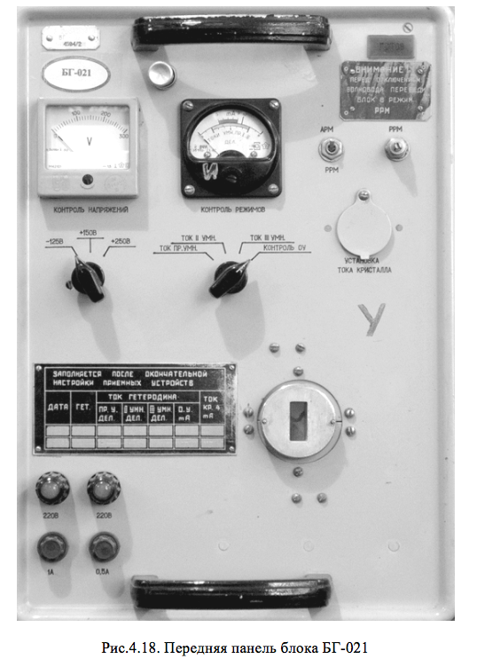

# КОНСТРУКЦИЯ ПРИЕМНИКА ПЕРВИЧНОГО КАНАЛА

Блоки обоих приемников первичного канала размещены в трех стойках: две стойки СПр-02 и СГ-02. В каждой из стоек СПр-02 расположены блоки в следующем порядке: УВЧ (рис.4.14), БПр-021 (рис.4.15), БП АПЧ (рис.4.16), БФ-02 (рис.4.17). На верхней раме каждой из двух стоек находятся распределительные коробки, от которых отходят высокочастотные кабели. Стойки приемников выполнены на базе типовых стоек. 

Справа расположена стойка СГ-02 с тремя блоками: два блока гетеродина БГ-021 (рис.4.18)  и один блок развертывающих напряжений БРН-021. С лицевой стороны стоек проходит волноводный тракт, соединяющий отдельные блоки волноводами. При необходимости выдвижения блоков из стоек волноводы могут быть сняты.

Конструктивно блок гетеродина с габаритными размерами 270х380х572 мм представляют собой типовую конструкцию. В основу блока заложена литая рама, к которой спереди крепится лицевая панель, а сзади – механизм удержания блока. Справа в верхней части рамы закреплен кронштейн, на котором установлен субблок АРМ и отдельные радиоэлементы. В нижней части рамы закреплено амортизационное устройство, на котором установлен гетеродин. Слева на раме расположены три выпрямителя.

На лицевой панели блока размещаются электроизмерительные приборы, переключатели, переменные резисторы, лампы и предохранители. На лицевую панель выводится через отверстие фланец волноводно-кабельного перехода от гетеродина. 

На лицевой панели имеются две ручки и замок. Сзади на раме установлены штыри - ловители и вилка типа РП14-30.

