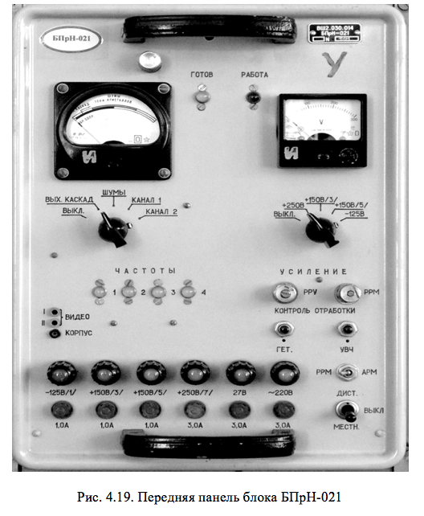

# КОНСТРУКЦИЯ ПРИЕМНИКА ВТОРИЧНОГО КАНАЛА

Блок приемника БПрН-021 размещен в стойке управления передатчиками  СУП-022 (рис.4.19). Он смонтирован на типовом шасси.

Слева (со стороны лицевой панели) размещены: усилитель высокой частоты, гетеродин, УПЧ, плата видеоусилителя и переключатель частот. Справа размещены линейки выпрямителей и стабилизаторов, а также панель с реле. На лицевой панели сверху установлены сигнальные лампы ГОТОВ и РАБОТА, ниже установлены контрольно-измерительные приборы, переключатели рода измерений. Под переключателями расположены сигнальные лампы выбранной частоты, контрольные гнезда ВИДЕО 1, ВИДЕО 2, КОРПУС, потенциометры регулировок мощности и усиления, кнопки контроля отработки механизмов перестройки гетеродина и УВЧ.

На нижней части панели расположены предохранители и соответствующие им лампы контроля исправности. В правом нижнем углу расположены переключатели выбора режимов РРМ-АРМ, МЕСТН.-ДИСТАНЦ. Высокочастотный разъем ВЫХОД расположен на задней части рамы. Там же расположен разъем питания и низкочастотных сигналов.

Схема коммутации блока БПрН-021 дает возможность осуществить:
- сигнализацию наличия напряжения накала и –125 В (по наличию сигнала «Готов»);
- местное и дистанционное включение с помощью переключателя В2 МЕСТН.- ДИСТАНЦ.;
- сигнализацию местного включения (сигнал «+27 В»);
- местное переключение фиксированных частот с помощью переключателя В2 ЧАСТОТА, при этом на лицевой панели блока загорается лампа выбранной частоты настройки;
- сигнализацию работоспособности блока БПрН-021 и отработку механизмов перестройки гетеродина  и УВЧ (сигнал «Работа»).

