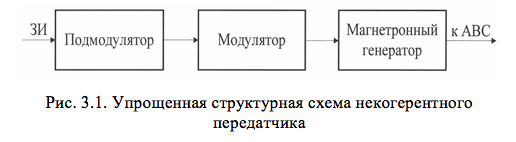
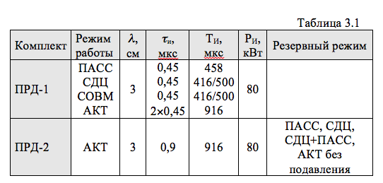

# ОСНОВНЫЕ СВЕДЕНИЯ О ПЕРЕДАЮЩЕМ УСТРОЙСТВЕ ПРЛ-6М2

Передатчик современной радиолокационной станции – один из ответственных и сложных элементов станции. От характеристик передатчика (мощности, частоты повторения, нестабильности частоты, несущей частоты, параметров элементной базы) во многом зависят тактические возможности РЛС: дальность действия, точность измерения координат, эксплуатационные характеристики. В посадочном радиолокаторе ПРЛ-6М2 применяется передатчик некогерентного импульсного типа (рис.3.1). Главное достоинство такого передатчика – простота исполнения, высокая надежность, невысокая стоимость, недостаток – низкая стабильность частоты.

Подмодулятор (ПМ) обеспечивает формирование запускающих видеоимпульсов по длительности, определяемой режимом работы ПРЛ-6М2, и амплитуде, необходимой для работы модулятора (UЗИ = 600…800 В). Модулятор (М) формирует высоковольтный видеоимпульс с амплитудой Um=26 кВ, обеспечивающий возникновение в магнетронном генераторе (МГ) незатухающих высокочастотных колебаний.

Передающее устройство ПРЛ-6М2 включает 2 передатчика (ПРД-1, ПРД-2), каждый из которых предназначен для формирования мощных радиоимпульсов, параметры которых приведены в табл.3.1.

Как следует из табл.3.1, каждый из передатчиков может работать в режимах ПАСС, СДЦ, СДЦ+ПАСС, АКТ. Однако ПРД-2 в активном режиме  (с подавлением) формирует одиночный импульс подавления длительностью &tau;И = 0,9 мкс.

При выходе из строя первого передатчика вместо него может использоваться ПРД-2. Низкая частота повторения (НЧП) и соотношение длительностиИ и периода повторения ТИ в различных режимах работы посадочного радиолокатора ПРЛ-6М2 обеспечивает выполнение равенства

где Q - скважность.

В состав каждого из передатчиков входят следующие блоки:
 		БПМ-021	- блок подмодулятора;
 		БУВ-021	- блок управления высоковольтным выпрямителем;
 		БВМ-021	- блок выпрямителя модулятора;
 		СП-01	- стойка передатчика.
		Первые три блока образуют стойку управления передатчиком – СУП-021.

