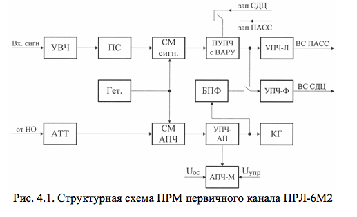

# ОСНОВНЫЕ СВЕДЕНИЯ О ПРИЕМНЫХ УСТРОЙСТВАХ ПРЛ-6М2

В состав ПРЛ-6М2 входят два идентичных приемника  (ПРМ) первичного канала, которые выполняют обработку отраженных сигналов, и один приемник вторичного канала, обрабатывающий ответные сигналы самолетного ответчика (СО). 

Как и в ДРЛ-6М2, основные функциональные элементы канала АПЧ магнетронного генератора конструктивно расположены в блоках приемников.

Для ПРЛ, в отличие от ДРЛ, особенностями отраженных от ЛА сигналов являются: 
 	- более детерминированный характер изменения мощности отраженных от ЛА сигналов по дальности; 
 	- больший динамический диапазон изменения мощности входного сигнала (более 60 дБ);
 	- сильное маскирующее влияние  полезных сигналов сигналами, отраженными от земли,  местных предметов и метеообразований.

Перечисленные особенности связаны с сантиметровым диапазоном работы ПРЛ, фиксированной линией посадки самолета, существенно меньшим значением минимальной дальности действия ПРЛ-6М2 – ДМИН 1,5…2 км.

Структурная схема ПРМ первичного канала приведена  на рис.4.1. Особенности построения приемника первичного канала: 
- УВЧ широкополосный (УВЧ = 400 МГц), малошумящий;
- УВЧ способен выдерживать мощные входные сигналы в течение достаточного времени, т.к. обладает свойствами АРУ;
- приемник не вводится в режим насыщения мощными сигналами от пассивных помех из-за применения:
     	- схемы ВАРУ в ПУПЧ;
     	- УПЧ-Л с логарифмической амплитудной характеристикой (схема МАРУ);
- фазирование когерентного гетеродина в режиме СДЦ выполняется сигналами от магнетронного генератора;
- подавление помех по зеркальному каналу выполняется в перестраиваемом преселекторе.

Функциональная схема приемника вторичного канала с каналом дешифрации ответных сигналов (ДШОС) приведена на рис. 4.2.

