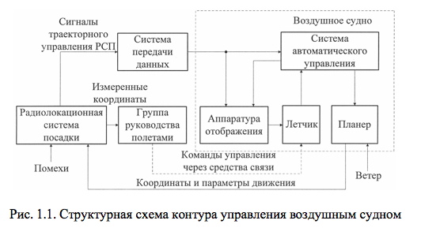
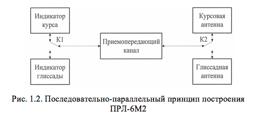
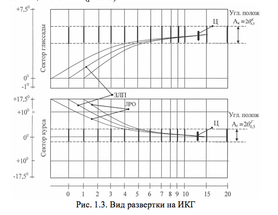

# ОСНОВНЫЕ СВЕДЕНИЯ О ПРЛ-6М2

ПРЛ-6М2 предназначен для измерения отклонений заходящего на посадку самолета от заданной линии планирования (ЗЛП) по курсу (в горизонтальной плоскости) и по глиссаде (по углу места в вертикальной плоскости), а также для измерения дальности до самолета от расчетной точки посадки (РТП).

В соответствии с предназначением ПРЛ-6М2 позволяет группе руководства полётами (ГРП) решать следующие задачи радиолокационного обеспечения полетов:
- осуществлять контроль за полетом самолета относительно ЗЛП в секторе по курсу 350 (–17,50…+17,50) и по глиссаде 90 (–10 …+80); 
- управлять (корректировать полет) воздушными судами при их последовательном заходе на посадку до высоты принятия решения (Н=120 м), подавая команды управления по радиостанции (ручной режим управления, рис.1.1 [1-4]);
- осуществлять индивидуальное опознавание самолета по вторичному каналу радиолокатора;
- получать информацию о состоянии бортового оборудования при приеме ответных сигналов режима БЕДСТВИЕ самолетного ответчика (при неполадках в бортовом оборудовании).

Таким образом, из вышеперечисленных решаемых задач следует, что в первую очередь ПРЛ должен обеспечивать ГРП информацией о трех координатах воздушного судна (летательного аппарата): дальности, азимуте (курсе) и угле места (глиссаде). В простейшем случае такую информацию можно получить с помощью двух независимых двухкоординатных РЛС, антенны которых сканируют соответственно в горизонтальной и вертикальной плоскостях. Однако для более целесообразного использования аппаратуры, удобства компоновки и по экономическим соображениям ПРЛ-6М2 построен по последовательно-параллель-ному принципу (рис.1.2).

В соответствии с этим принципом два отдельных параллельных канала – курсовой и глиссадный – имеют много общих объединенных элементов (передатчик, приемник, аппаратура обработки сигналов), которые последовательно работают то на курсовой, то на глиссадный канал. Поочередное переключение производится с помощью коммутаторов К1 и К2. На экран совмещенного индикатора курса и глиссады (ИКГ) информация выводится последовательно с периодом переключения не более 1 с. Непрерывность наблюдения за целью обеспечивается за счет большого послесвечения люминофора совмещенного ИКГ (рис.1.3).

В зоне посадки ПРЛ-6М2 обеспечивает ГРП (руководителя ближней зоны (РБЗ) и руководителя зоны посадки (РЗП)) информацией для решения задачи только ручного управления воздушным судном. Радиолокатор ПРЛ-6М2 может быть использован как автономное средство обеспечения посадки или как средство контроля за посадкой летательных аппаратов (ЛА) на аэродромах, оборудованных инструментальными системами посадки. В настоящее время радиолокатор ПРЛ-6М2 используется в основном как средство контроля за посадкой ЛА. Это обусловлено низкой точностью ручного управления ЛА на заключительном этапе полета, причинами которой являются низкая точность измерения отклонений ЛА от ЗЛП (амплитудный метод максимума измерения курса и глиссады), низкий темп обновления информации для управления ЛА, большие ошибки, вносимые операторами управления [2].

ПРЛ может функционировать в следующих режимах: пассивном (ПАСС), селекции движущихся целей (СДЦ), совмещённом (ПАСС+СДЦ), активном (АКТ). Как и в дрл-6М2, режим ПАСС используется в тех случаях, когда отношение сигнал/(шум+помеха) существенно больше единицы (в простых метеоусловиях, без помех, ЭПО цели &sigma;ц>>1м2), режим СДЦ – при отношении сигнал/(шум+помеха) меньше единицы (при наблюдении цели на фоне мощных пассивных помех: метеообразования, дипольные отражатели, земная поверхность, местные предметы и т.п.). Совмещенный режим является основным режимом работы ПРЛ при управлении воздушными судами при заходе на посадку, начиная примерно с дальности 20 км и до точки принятия решения (ближнего привода). При малой высоте полета ЛА (при нахождении самолета на удалении до 8…10 км от ПРЛ) отраженные сигналы подвергаются обработке по алгоритму когерентной пачки, как в режиме СДЦ, на больших дальностях – по алгоритму некогерентной пачки, как в режиме ПАСС. Режим АКТ используется при посадке ЛА с малой ЭПО (&sigma;ц>>1м2), а также для получения с ЛА служебной информации в виде ответных сигналов «Посадка (ПОС)», «Опознавание (ОП)», «Бедствие (БД)», «Шасси выпущено (ШВ)».

С целью повышения надежности ПРЛ-6М2 выполнен в двухкомплектном исполнении. Метод подавления ложных ответных сигналов в активном режиме – по каналу запроса, то есть в самолетном ответчике. Радиолокатор имеет следующие тактико-технические характеристики [5].

<b>Тактические характеристики ПРЛ-6М2</b>

Зона обнаружения ПРЛ-6М2 обеспечивает обнаружение и определение координат летательных аппаратов с ЭПО &sigma;ла=15v2, которое находится в пространстве, ограниченном сектором по азимуту (курсу) ФАЗ(К) = 35&deg; ( 17,5&deg;) и по углу места (глиссаде) ФУМ(Г) = 9&deg; (-1…+8)&deg; на дальности:
 	 - Дмакс &ge; 20 км в ПАСС режиме работы;
 	 - Дмакс &le; 20 км в режиме СДЦ;
 	 - Дмакс &ge; 40км в АКТ режиме работы.
 	Разрешающая способность: 
 	- по дальности &sigma;Д–  200м; 
 	- по угловым координатам – &sigma;&phi;к=1,75&deg;, &sigma;&phi;г=1,25&deg;.
 	
    Точность измерения координат ЛА: 
 	- по дальности - &sigma;д=200 м;
 	- по угловым координатам – &sigma;&phi;ж=24', &sigma;&phi;д=15'.
 	
    Темп обновления информации ТОИ  &ge; 1 с.
    
<b>Технические характеристики ПРЛ-6М2</b>

Импульсная мощность передатчика –  Pи=80 кВт.

Чувствительность приемника:
 	 -Pпрм мин &le; -120 дБ/Вт в режиме ПАСС и СДЦ;
 	 -Pпрм мин &le; -112 дБ/Вт в режиме АКТ.

Длительность импульса: 
 	 - &tau;и=0,45 мкс в режиме ПАСС и СДЦ;
 	 - два импульса с  &tau;и=0,45 мкс в режиме АКТ без подавления и три импульса в режиме АКТ с подавлением с &tau;и=0,9 и 2х0,45 мкс.

Период повторения импульсов:
 	 - Ти=458 мкс в режиме ПАСС;
 	 - Ти=416/500мкс в режиме СДЦ;
 	 - Ти=916мкс в режиме АКТ. 

Длина волны - &lamda;=3,2 см (в диапазоне частот 9170…9570 МГц – 6 волн через 80 МГц).
Масштаб индикаторного устройства – М20 км, М40 км.
Дальность радиосвязи с ЛА, летящим на высоте H=1000 м, – ДP/CB &le; 60 км. 

