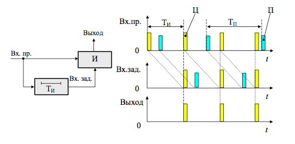
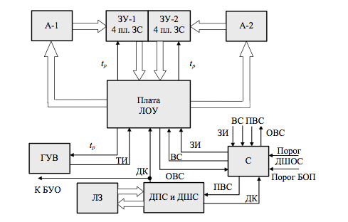
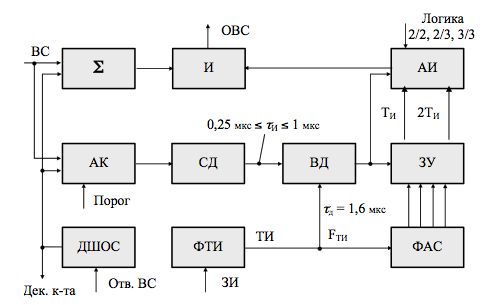
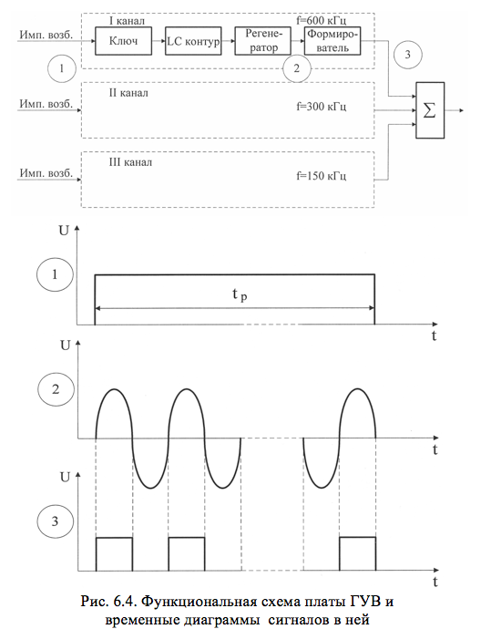

# ОСНОВНЫЕ СВЕДЕНИЯ ОБ АППАРАТУРЕ ЗАЩИТЫ ПРЛ-6М2 ОТ АКТИВНЫХ ПОМЕХ

# ОСНОВНЫЕ СВЕДЕНИЯ ОБ АППАРАТУРЕ ЗАЩИТЫ ПРЛ-6М2 ОТ АКТИВНЫХ ПОМЕХ

В реальных условиях работы любой РЛС вместе с полезным сигналом принимаются и различные помеховые сигналы: отраженные сигналы от местных предметов и метеообразований (гидрометеоров), сигналы от различных радиотехнических систем, промышленные и атмосферные помеховые сигналы, сигналы, излучаемые и принимаемые боковыми лепестками диаграммы направленности антенны РЛС, внешние и внутренние шумовые сигналы. Очевидно, что в условиях боевой обстановки, наряду с непреднамеренными помехами (помехами естественного происхождения), будут добавляться преднамеренные (специально организованные) помехи. 

Защита ПРЛ-6М2 от различного рода помех основана на комплексном использовании методов и средств защиты от помех. В основу всех способов защиты положено какое-либо различие в параметрах полезного сигнала и помехи. Основу методов защиты ПРЛ-6М2 от активных помех составляют различные методы селекции, в частности амплитудная селекция, селекция по ТИ и селекция по И. Часть методов защиты от помех в ПРЛ-6М2 реализовано в блоке БОП – блоке очистки от помех. 

Основным назначением БОП является очистка полезных сигналов от несинхронных импульсных помех (НИП) и хаотических импульсных помех (ХИП), от РЛС со схожими параметрами зондирующих сигналов. Принцип работы БОП основан на выявлении различий в периодах повторения импульсов полезных и помеховых сигналов.

Принцип подавления НИП и ХИП можно пояснить, используя временные диаграммы, представленные на рисунке 13.1. Период повторения полезного сигнала не равен периоду повторения помехи (ТИ&ne;ТП), поэтому помеховые сигналы не пройдут на выход схемы. Рассмотрена логика обработки сигналов два из двух (i/j=2/2), т.е. в двух смежных периодах повторения (j=2) присутствует два сигнала от цели c периодом повторения равным ТИ (i=2). БОП выполнен на цифровых элементах. В его состав входят (рисунок 13.2):
- ЛОУ		–	платы логической обработки и управления;
- ГУВ		–	плата генератора ударного возбуждения;
- ЗУ		–	плата запоминающего устройства;
- А1, А2	–	две платы адресации;
- С		–	плата сопряжения;
- ДПС		–	плата декодирования посадочного кода;
- ДШВ		–	плата декодирования сигнала "шасси выпущено";
- ЛЗ		–	плата линии задержки.

Последние три платы конструктивно образуют декодирующее устройство (ДУ).

Рисунок 13.1. Принцип защиты от НИП и ХИП

Плата ГУВ – генератор ударного возбуждения – служит для формирования тактовых импульсов. На плате расположены три ГУВ, каждый из них генерирует импульсы со своей частотой повторения: 600 кГц, 300 кГц, 150 кГц.

Плата ЛОУ – плата логической обработки и управления  предназначена для логической обработки информации, записываемой в ЗУ и считываемой из него, и управления этим процессом на всех его этапах. Плата ЛОУ селектирует и нормализует импульсы по длительности, анализирует информацию путем сопоставления выборок с одноименных дискретов дальности, разделенных во времени одним или двумя периодами, вырабатывает импульс, определяющий величину рабочей дальности БОП и направляет его на плату ГУВ и платы А1, А2.

Рисунок 13.2. Блок-схема БОП

Платы адресации А1, А2 предназначены для выработки адресных импульсов с целью последовательного адресного перебора ячеек памяти ЗУ. Основу каждой платы составляют два кольцевых счетчика.

ЗУ – запоминающее устройство предназначено для записи, хранения и считывания сигналов. ЗУ разделено на две части (ЗУ-1 и ЗУ-2) по 4 платы ЗС (запоминающей среды). Это необходимо для обеспечения логики обработки ВС по критериям 2/3 и 3/3. Каждая плата ЗС состоит из массива ячеек памяти (триггеров), индивидуальных адресных ключей и выходного нормализатора длительности считанного сигнала.

Плата С – сопряжения предназначена для сопряжения ламповой РЛС с цифровым БОП, т.е. выполняет роль аналогово-цифрового преобразователя (АЦП). Она также выполняет завершающую операцию по очистке сигнала от помех – логическое перемножение входного ВС и очищенного. Если происходит временное совпадение этих сигналов, то на выход схемы проходит импульс, длительность которого равна длительности входного ВС. Плата С выполняет двухстороннее ограничение входных сигналов (снизу и сверху), что предотвращает повреждение микросхем БОП и  позволяет осуществить амплитудную селекцию радиолокационного сигнала на фоне помех.

Структурная схема БОП приведена на рисунке 13.3.

рисунок 13.3. Структурная схема БОП

При отсутствии импульса возбуждения электронный ключ открыт, шунтируя LС контур. При поступлении импульса возбуждения на вход электронного ключа в контуре возникают синусоидальные колебания с частотой Fи. Контур структурно включен в состав регенератора, на выходе которого колебания будут незатухающими (рис.6.4, эпюра 2). Формирователь ГУВ преобразует синусоидальные колебания в последовательность прямоугольных импульсов с частотой F, которые через сумматор поступают на выход (рис.6.4, эпюра 3). По окончании импульса возбуждения колебания в контуре срываются за счет шунтирования его малым сопротивлением ключа.

