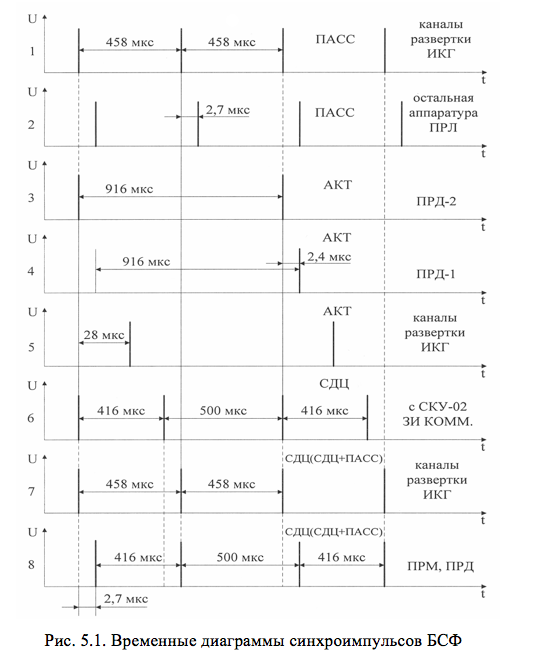

# ОСНОВНЫЕ СВЕДЕНИЯ ОБ УСТРОЙСТВЕ СИНХРОНИЗАЦИИ ПРЛ-6М2

Устройство синхронизации в ПРЛ реализовано в блоке синхронизации и формирования (БСФ). Блок обеспечивает формирование следующих управляющих импульсов для основных каналов радиолокатора:
- ЗИ ПАСС с FИ=2180 Гц (ТИ=458 мкс);
- ЗИ АКТ с FИ=1090 Гц (ТИ=916 мкс);
- ЗИ СДЦ с переменным периодом повторения ТИ1=416 мкс, ТИ2=500 мкс.

В режиме СДЦ блок БСФ выполняет только функции ретранслятора импульсов ЗИ СДЦ с компенсирующего устройства, запускающих импульсов БОП, БУО-П, на КДП, в СПр-021 (на схему ВАРУ). Кроме того, в блоке БСФ выполняется дешифрация отраженных от цели сигналов в АКТ режиме работы ПРЛ.

На рис.5.1 приведены временные диаграммы синхроимпульсов БСФ для всех режимов работы ПРЛ.

В ПАСС режиме работы посадочного радиолокатора индикатор курса и глиссады запускается на 2,7 мкс раньше, чем передатчики, что необходимо для компенсации нелинейного начального участка развертки (эпюра 1). В АКТ режиме период повторения ЗИ составляет 916 мкс, что обеспечивает однозначное определение дальности в зоне не менее 40 км. При этом в АКТ режиме с подавлением используются оба передатчика ПРЛ: первым запускается (эпюра 3) второй передатчик (ПРД-2), формирующий радиоимпульс подавления длительностью &tau;И=0,9 мкс, а через 2,4 мкс – ПРД-1 (эпюра 4), который формирует кодовую пару импульсов длительностью &tau;И= 0,45 мкс каждый. Так как на декодирование запросных импульсов в самолетном ответчике и ответных сигналов ответчика в БОП необходимо дополнительное время, то для получения соответствия положения на временной оси декодированного ответного сигнала истинной дальности до самолета ИКГ запускается в АКТ режиме с задержкой на 28 мкс (эпюра 5). В режиме СДЦ запускающие импульсы в БСФ поступают с компенсирующего устройства КУ-02 с вобуляцией периода повторения (эпюра 6).
Как и в ПАСС режиме, ЗИ ПРД в режиме СДЦ задерживаются на 2,7 мкс (эпюра 8). Так как при обработке отраженных сигналов в КУ-02 период повторения усредняется, то для запуска каналов развертки используются синхроимпульсы с постоянным периодом повторения ТИ=458 мкс (эпюра 7). В совмещенном режиме (СДЦ+ПАСС) используются такие же запускающие импульсы, что и в режиме СДЦ.

