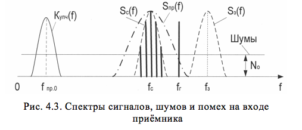

# ПРЕСЕЛЕКТОР

Преселектор предназначен для ограничения спектра шумов, поступающих с блока УВЧ, и ослабления сигналов зеркального канала на fз (рис.4.3). Полоса пропускания преселектора – 35 МГц, затухание – не более 3 дБ. Преселектор представляет собой перестраиваемый волноводный объемный резонатор, настраиваемый на рабочую частоту (fс) и связанный с блоком УВЧ и смесителем через отверстия связи.

Перестройка преселектора на рабочие частоты производится путем введения фарфорового стержня в резонатор. Введение стержня в преселектор эквивалентно изменению емкости колебательного контура, а следовательно, и частоты его настройки. Перемещение стержня преселектора производится вручную с помощью микрометрического винта, снабженного шкалой малых перемещений и стопорным устройством.
