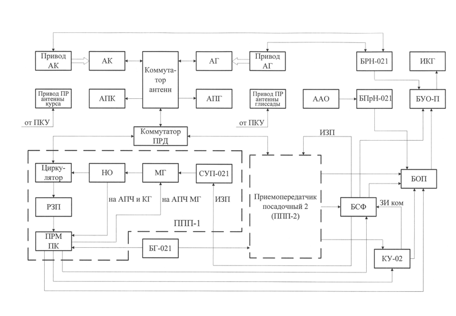
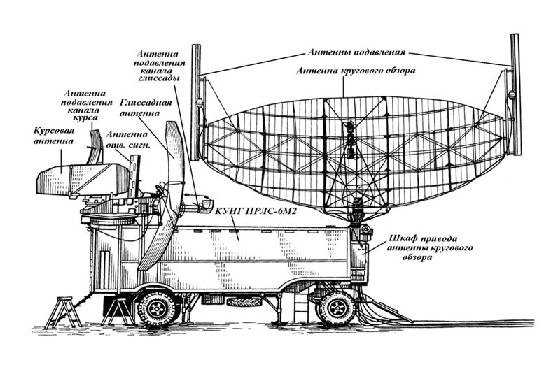
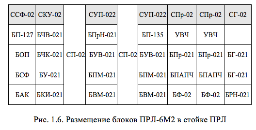
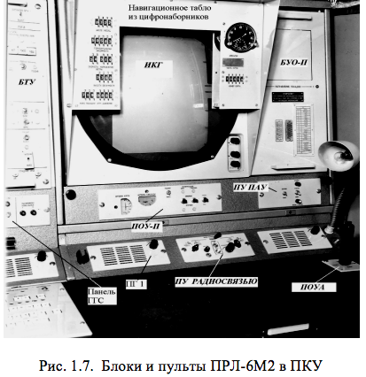

# СТРУКТУРНАЯ СХЕМА, СОСТАВ И РАЗМЕЩЕНИЕ БЛОКОВ ПРЛ-6М2

Структурная схема посадочного радиолокатора ПРЛ-6М2 представлена на рис.1.4. 

Рис. 1.4. Структурная схема ПРЛ-6М2

Рис. 1.5. Кунг с ПРЛС-6М2 на позиции

В состав ПРЛ-6М2 входят следующие основные функционально связанные устройства (рис.1.4, 1.5, 1.6):
- антенная система канала глиссады	– АГ, АПГ;
- антенная система канала курса – АК, АПК;
- антенна приема активного ответа – ААО;
- приемопередатчик обзора – ППП-1;
- приемопередатчик подавления – ППП-2;
- коммутатор антенн – КА;
- коммутатор передатчиков – КП;
- стойка синхронизации и формирования (ССФ-02), в состав которой входят: блок питания (БП-127); блок очистки от помех (БОП); блок синхронизации и формирования (БСФ); блок автоматического контроля (БАК);
- стойка компенсирующего устройства с аппаратурой КУ-02 (СКУ-02), включающая: блок череспериодного вычитания (БЧВ-021); блок череспериодной компенсации (БЧК-021); блок усреднения (БУ-021); блок компенсатора импульсный (БКИ-021);
- две стойки управления передатчиком, которая состоит из: наземного приемника активного канала (БПрН-021); блока управления выпрямителем (БУВ-021); блока подмодулятора (БПМ-021); блок выпрямителя модулятора (БВМ-021);
 - две стойки приемников (СПр-02), содержащая: усилитель высокой частоты (УВЧ); блок приемника пассивного канала (БПр-021); блок питания и автоматической подстройки частоты (БП-АПЧ); блок фазовый (БФ-02);
- две стойки питания (СП-02); 
- стойка гетеродинов (СГ-02), включающая 2 блока гетеродинов (БГ-021) и блок развертывающих напряжений (БРН-021);
- пульт контроля и управления (ПКУ), на котором расположены (рис.1.7):
- индикатор курса и глиссады;
- блок управления отображением (БУО-П);
- блок технического управления (БТУ);
- пульт оперативного управления антеннами (ПОУА);
- пульт оперативного управления поляризационными решетками (ПОУ-П);
- пульт управления фоторегистрирующим устройством ПАУ-476 (ПУ ПАУ);
- пульт управления радиосвязью.

