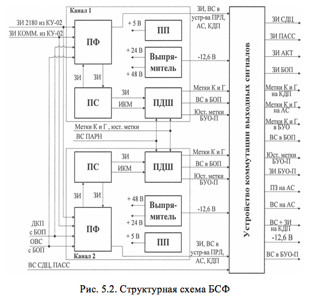

# СТРУКТУРНАЯ СХЕМА БЛОКА СИНХРОНИЗАЦИИ И ФОРМИРОВАНИЯ

По своей структуре БСФ состоит из двух идентичных каналов, один из которых находится в работе, а другой в  «горячем резерве» (рис.5.2).

Входные сигналы подаются на оба канала, а выходные сигналы поступают к потребителям от того канала, который задействован в работу. Каждый из каналов включает плату формирователей (ПФ), плату синхронизации (ПС), плату дешифратора (ПДШ). Плата формирователей обеспечивает усиление входных и выходных сигналов блока. Основным элементом БСФ является плата синхронизации, в которой формируются все запускающие импульсы. В режиме СДЦ запускающие импульсы формируются из последовательностей ЗИ 2180 и ЗИ КОММ, поступающих из КУ-02, а в АКТ и ПАСС режимах формируются автономно в БСФ. В плате дешифратора выполняется декодирование и задержка отраженных сигналов с выхода приемника в АКТ режиме работы посадочного радиолокатора. Кроме того, плата дешифратора обеспечивает формирование угловых меток курса и глиссады, юстировочных угловых меток по сигналам от фотодатчиков, расположенных в антенных приводах по курсу и глиссаде.

